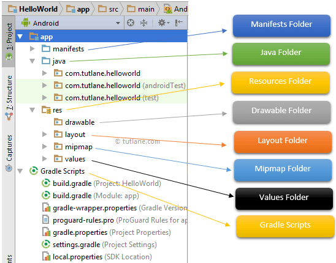

# Android Applications

- source: https://guides.codepath.com/android


## Project Structure





**Java Folder**

- contains all the java (.java) code. Application as well as test code.
- default class file is called `MainActivity.java`

**Res (Resources) Folder**

- contains all non-code resources (images, UI strings, XML layouts)
- `res/layout`: defines the user interface of the application. See also section "Layouting"
- `res/mipmap`: contains app/launcher icons
- `res/values`: contains .xml files defining colors, style definitions ,static array of strings/integer etc

**Manifests Folder**

- contains a manifest file (`AndroidManifest.xml`) for the application with information about Android veresion, access permissions, metadata etc. Acts as an intermediate between Android OS and the application.

**Gradle Scripts**

- Gradle is an automated build system that relies on `.gradle` configuration files


**Android Layout Files**


## Layouting

**Storage path:** `res/layout/`


```html
<LinearLayout xmlns:android="http://schemas.android.com/apk/res/android">
</LinearLayout>
```


### Linear layout


| property | value |
|--------|--------|
|`layout_width` | width       |
|`layout_height`| height |

**custom values**

| value | effect |
|--------|--------|
|`match_parent` | auto expand      |


```html
<LinearLayout xmlns:android="http://schemas.android.com/apk/res/android"
    xmlns:tools="http://schemas.android.com/tools"
    android:layout_width="match_parent"
    android:layout_height="match_parent"
    android:orientation="horizontal" >
</LinearLayout>
```


## Application Logic


## Debugging


### Screen Sharing

- Command-line tool: https://github.com/Genymobile/scrcpy
- Wysor


### Logging with Logcat

- `Log.e(tag: String, msg: String)` error
- `Log.w(tag: String, msg: String)` warning
- `Log.d(tag: String, msg: String)` debug


## Java


**Display install Java VMs**

```
/usr/libexec/java_home -V
```


