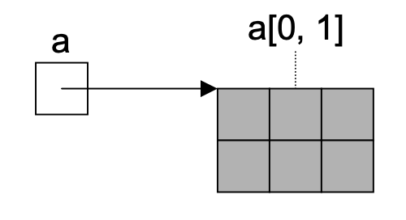
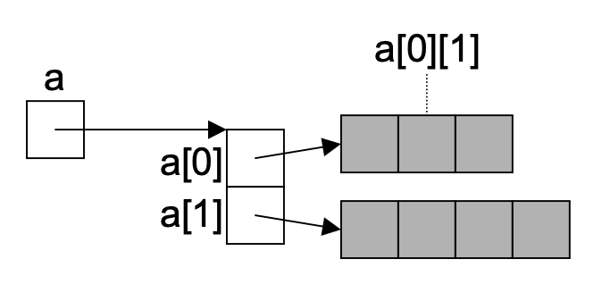

# C#


## Project Structure

- `.cs` file ending
- `Main` function is entry point


### Naming Convention


### Example


File 1

```c#
class Counter {
  int val = 0;
  public void Add(int x) {
    val += x;
  }
  public int Val() {
    return val;
  }
}
```

File 2

```c#
class Hello {
  static void Main() {
    Counter c = new Counter();
    c.Add(123);
    Console.WriteLine("Counter value: " + c.Val());
  }
}
```


## Type System

- all types are compatible with `object` (assignment and operations)


### 00. Boxing and Unboxing

- value types are compatible with `objects` as well
- allows to implement generic container types


**Example: **allocating an `int` on the heap

```c#
// wrap integer into an object
object obj = 3;
// assign to integer
int x = (int)obj;
```


**Example:** generic queue


```c#
class Queue {
  public void Enqueue(object item) {...}
  public object Dequeue() {...}
}
```


### 01. Value Types


#### Enums

```c#
enum Color { // values: 0, 1, 2
  red,
  blue,
  green
}
```


### 02. Reference Types


#### Strings

- **immutable**, use `StringBuilder` for modification
- `+` for concatenation
- `.Length` for length
- utilities:
  - `CompareTo`
  - `IndexOf`
  - `StartsWith`
  - `Substring`


```c#
string s = "Alfonso";
s = s + "asdf";
```


#### Structs

- stored on **stack**
- **no** inheritance
- **no** destructors


Declaration:

```c#
struct Point {
  public int x, y;
  // constructor
  public Point(int x, int y) {
    this.x = x; this.y = y;
  }
  // member method
  public void MoveTo(int a, int b) {
    x = a;
    y = b;
  }
}
```

Use:

```c#
Point p = new Point(3, 5);
p.MoveTo(6, 2);
```


#### Arrays (1D)

```c#
int[] a = new int[3];
int[] a = {3, 4, 5};
```


#### Arrays (ND)

- supports to initialize on local continuous memory

```c#
int[,] a = new int[2,3]
```


Multidimensional memory layout:



"Naive" stacked arrays:




## Classes

- reference type, allocated on heap
- inheritance
  - only from **one** other class
  - from multiple interfaces


### 01. Parameters


1. **Pass by value**

- formal parameter is **copy** of actual parameter

```c#
void inc(int x);
```

2. **Pass by reference**

- use `ref`
- formal parameter is an **alias** of the actual parameter

```c#
void inc(ref int x)
```

3. **Output parameters**

- similar to ref but no value is passed to caller

```c#
void Read(out int first, out int second);
// call the method
int first;
int second;
Read(first, second);
```


#### Variable Parameters


### 02. Properties

> Syntactic sugar for get/set methods

- Usage/declaration
  - use `get` and `set` clauses
  - `value` contains the input on `set`
- benefits
  - allows read-only and write-only fields
  - substitute for fields in interfaces


Declaration:

```c#
class Data {
  
  string filename;
  
  public string FileName {
    set {
      filename = value;
    }
    get {
      return filename;
    }
  }
}
```

Usage:

```c#
Data d = new Data();

d.FileName = "lorem-ipsum";
string s = d.FileName;
```


## Namespaces


Definition

```c#
namespace Util {
  public enum Color{...}
}
```

Usage

```c#
Util.Color;
```


## Control Structures


