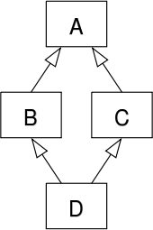
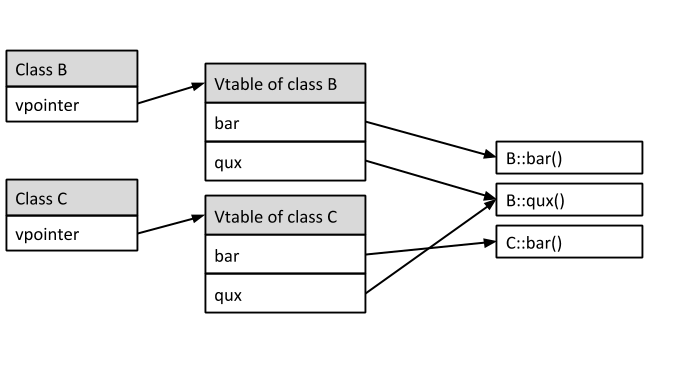

# Polymorphism

> Polymorphism is **the ability of a programming language to present the same interface for several different underlying data types**. Polymorphism is the ability of different objects to respond in a unique way to the same message.


**Resources:**

- https://isocpp.org/wiki/faq/multiple-inheritance#virtual-inheritance-where


**Summary**

- Function overriding makes it impossible to dispatch virtual functions statically (at compile time)
- Dispatching of virtual functions needs to happen at runtime
- The virtual table method is a popular implementation of dynamic dispatch
- For every class that defines or inherits virtual functions the compiler creates a virtual table
- The virtual table stores a pointer to the most specific definition of each virtual function
- For every class that has a *vtable*, the compiler adds an extra member to the class: the *vpointer*
- The *vpointer* points to the corresponding vtable of the class
- Always declare desctructors of base classes as virtual


## The Diamond Problem

> The "diamond problem" (sometimes referred to as the "Deadly Diamond of Death") is an ambiguity that arises when two classes B and C inherit from A, and class D inherits from both B and C.


**Problems:** 

1. A contains 2 copies of D's member variables. 1 from B and 1 from C.
   - **Solution:** use `virtual` inheritance

2. Calls to methods of D from A are unambiguous (through B or C?). 
   - **Solution: ** is addressed by V-Tables / dynamic dispatch (see next section)





**Example**

- `ta.speak()` is ambiguous since any `TeachingAssistant` object has two different `Person` base class subjects

```cpp
struct Person {
    virtual ~Person() = default;
    virtual void speak() {}
};

struct Student: Person {
    virtual void learn() {}
};

struct Worker: Person {
    virtual void work() {}
};

// A teaching assistant is both a worker and a student
struct TeachingAssistant: Student, Worker {};

TeachingAssistant ta;
```


## Static vs Dynamic Dispatch

> There are two ways of how the definition of a routine is resolved.
>
> 1. static dispatch: The compiler knows the definition of the routine at compile time
> 2. Dynamic dispatch: The definition of the routine has to be resolved at runtime


**Static dispatch / early binding**

> Compiler creates a **single** routine for `bar()`. This routine will be executed every time the compiler finds a call to `bar()` for an instance of `A`

```cpp
class A {
public:
  void bar();
};
```


**Dynamic dispatch**

- `virtual` methods can be overwritten in subclasses
- calls via pointers/references to base class **can not** be dispatched at compile time - compiler has to find the right function definition at runtime (= dynamic dispatch/late method binding)

```cpp
class B : public A {
public:
  void bar() override;
};
```


```cpp
A* a = new B();
// we expect B::bar to be called
a->bar();
```


### V-Tables

> Implements the routes to resolve methods definitions at runtime (dynamic dispatch)

- created by compiler at compile time
- single vtable per class (shared among all instances!)
- Contains entry for each virtual function accessible by the class and stores pointer to its (most specific) definition


**Example**

- V-table of B: 
  - points to the local definition of functions since they are the most specific from B's point of view

- V-table of C: 
  - `bar` points to `C::bar` since it overrides `B::bar`
  - `qux` still points to `B::qux` since it was not overridden

```cpp
class B {
public:
  virtual void bar();
  virtual void qux();
};

class C : public B {
public:
  void bar() override;
};
```



**Example:** What the compiler does for class B

> Similar is done for class C. The C V-Table is partially linked to the implementations on B though.

Generated V-Table interface:

```cpp
struct VTable_B {
  int identifier;
  void (*bar)(B* this);
  void (*qux)(B* this);
}
```

Generated routing through v-table:

```cpp
struct SBase
{
   VTable_B* vtable;
   // functions route through vtable
   inline void bar(Base* this) { vtable->bar(this); }
   inline void qux(Base* this) { vtable->qux(this, x); }
};
```

Actual V-Table:

``` cpp
VTable_B vtable_b = { 
   1234567, &B::bar, &B::qux
};
```


### V-Pointers

- attached to every class by compiler (regular member) and points to the corresponding *vtable* of the class
- **NOTE:** Increases size of every object that has a *vtable* by `sizeof(vpointer)`


Every time a call to a virtual function is performed:

1. *V-pointer* of object is used to find corresponding *V-Table*
2. Function name is used as index to the *V-Table* to find the (most specific) routine to be executed


## Type Casting and Virtual Inheritance

> **Note**
>
> - type casting = handling derived class instance/object using a base class pointer or reference
>
> - casting doesn't change dynamic type of underlying object


**Example:** Access through base pointer

```cpp
Derived derived;
Base * base = static_cast<Base*>(derived);
```

- Instance `derived` has a v-pointer pointing to a v-table to resolve the implementations of the `virtual` methods
- by casting from type `Derived` to `Base`, we're treating the pointer as if it points to an instance of `Base`
- the actual object has not changed in value and v-pointer on `base` still points to the v-table of `Derived`
- when accessing methods through the `Base` pointer at runtime, the address of the virtual method is taken from the virtual table from `Derived`


## `virtual` Inheritance in Practise

- `virtual` methods can be overwritten in derived classes
  - allows to access implementation of **derived** class, even though instance is managed through reference to base class
  - only for non-static methods
  - overriden `virtual` methods are also `virtual`
- `override` keyword used to annotate overwritten methods
  - shows user that method is virtual
  - helps compiler perform checks

- `final` keyword instead of `override` to prevent further overriding


**Initialization order**

- order of inheritance: left to right
- order of constructors:
  1. virtual base classes anywhere in hierarchy (left to right/depth-first)
  2. base class
  3. derived class


```cpp
class A : public B, public C {
  
}
```


### Issue 1: Preventing base class duplication

- Like with method, also class members can be ambiguous


```cpp
class Base {
  protected:
    int data_;
}

// use "virtual" inheritance before the "join"
class Der1 : public virtual Base { ... }
class Der2 : public virtual Base { ... }

class Join : public Der1, public Der2 {
  public:
	void method() {
    // Good: this is now unambiguous
    data_ = 1;
  }  
}
```


```cpp
                         Base
                         /  \
                        /    \
               virtual /      \ virtual
                    Der1      Der2
                       \      /
                        \    /
                         \  /
                         Join
```


### Issue 2: Preventing Destructor obfuscation

- **Problem**: if derived class is handled via base class reference, a non-virtual destructor will be dispatched **statically** - obfuscating the destructor of the derived class
  - when calling `delete` to pointer of base class, destructor of **derived** class **is not called!** This can lead to memory leaks.

- **Solution:** add `virtual` destructor if class has at list one `virtual` method


```cpp
class ISample {
  public:
  virtual ~ISample() = default;
  virtual void doSomething();
}
```


## Method calls between levels of inheritance


### Calling `virtual` Child Method in Parent

```cpp
class A {
  public:
  virtual void do();
  void go() {
    do();
  }
}
class B : public A {
  public:
  // this will override call go from A
  virtual void do();
}

A* obj = new B;
B->go();
```


### Calling `virtual` Base Method in Child

```cpp
class Bar : public Foo {
  void printStuff() override {
    Foo::printStuff(); // calls base class' function
  }
};
```


### Calling `virtual` Method in Constructor

- **NOTE**: Calling virtual functions from a constructor or destructor is **dangerous**  and should be avoided whenever possible!


All C++ implementations should call the version of the function defined at the level of the hierarchy  in the current constructor and no further.

The reason is that C++ objects are constructed like onions, from the  inside out. Base classes are constructed before derived classes. So,  before a B can be made, an A must be made. When A's constructor is  called, it's not a B yet, so the virtual function table still has the  entry for A's copy of fn().


**Workaround:** Factory

```cpp
class Object {
public:
  virtual void afterConstruction() {}
};

template<class C>
C* ObjectFactory() {
  C* pObject = new C();
  pObject->afterConstruction();
  return pObject;
}
```

Usage

```cpp
class MyClass : public Object {
public:
  virtual void afterConstruction() {}
};

auto obj = ObjectFactory<MyClass>();
```


## Managing Instances through Interface

See also separate documentation about "Types and type casting".


### Passing reference to interface/abstract class

> A reference to an abstract class is just like a pointer to an abstract class: it needs to reference an object of some non-abstract subclass of the abstract class. 


An abstract class is designed to be derived from. The Liskov substitution principle (see SOLID principles) roughly states that anything that uses the abstract parts of types derived from an abstract base should work equally well using the base polymorphically. That means a reference or pointer to the base should be used.


Use pointer:

- If there's ever a chance that you could want to pass "no object"
- If you want ability to point the passed pointer to different location


## Design Considerations


- see https://isocpp.org/wiki/faq/multiple-inheritance#mi-not-evil-2

