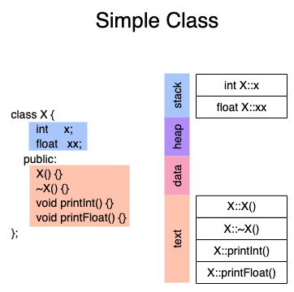
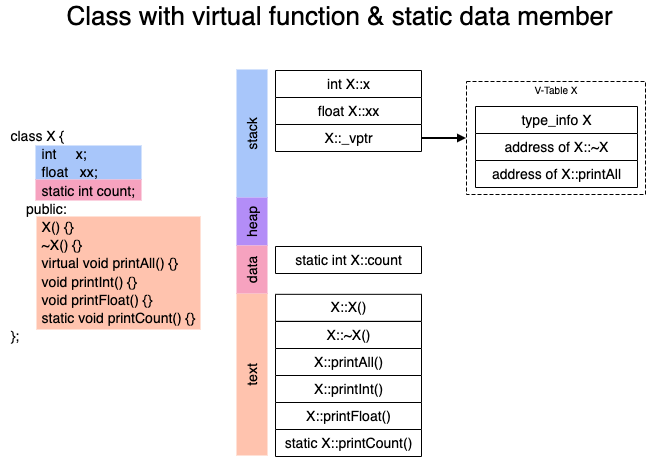
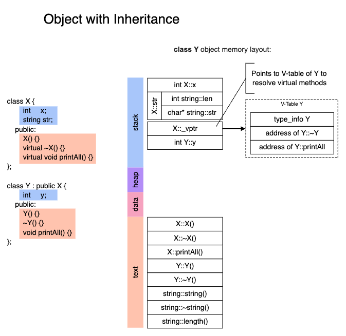

# Memory Management and Caching


**Reads to summarise**

- 

**Topics**

- RAII
- Stack/heap, allocation/cleanup
- cache miss
- branching (prediction)
- memory layouts
- ...


## Program Memory

- [Summary](https://docs.microsoft.com/en-us/cpp/cpp/object-lifetime-and-resource-management-modern-cpp?view=vs-2017)
- Most modern OS's use similar system
- Memory segments are separated based on permission
  - Code (text section) has execute permission, other segments don't


#### Memory Sections


**Stack**

- runtime memory

**Heap** (R/W, no execute)

- dynamically allocated storage
- allocated by `malloc` (C), `new`

**Data**

- *statically* allocated data, read from disk
  - Read-only: string literals
  - Read/write: global arrays and variables
- initialized and uninitialized sections
  - `static int;` vs `static int = 32;`

**Text**

- executable machine instructions (method definitions)
- read-only
- placed below stack/heap to prevent overflow from overwriting it


#### Stack Buffer Overflows

- when program writes to a memory address on the program's call stack outside of intended data structure - more data is written to a buffer than is actually allocated
- can be exploited to take control of the process by injecting code into the executable memory section of the program 


## Memory Layout of C++ Objects

Resources:

- https://dev.to/visheshpatel/memory-layout-of-c-object-1p17

- https://www.bogotobogo.com/cplusplus/assembly.php











## Memory Management

```cpp
YourClass foo;
Rectangle rect (3,4);	// constructor with arguments

// Method 1
Foobar *foobar = new Foobar();
delete foobar; // TODO: Move this to the right place.

```

- Method 1 (using new)
  - Allocates memory for the object on the free store (This is frequently the same thing as the heap)
  - Requires you to explicitly delete your object later. (If you don't delete it, you could create a memory leak)
  - Memory stays allocated until you delete it. (i.e. you could return an object that you created using new)
  - The example in the question will leak memory unless the pointer is deleted; and it should always be deleted, regardless of which control path is taken, or if exceptions are thrown.
- Method 2 (not using new)
  - Allocates memory for the object on the stack (where all local variables go) There is generally less memory available for the stack; if you allocate too many objects, you risk stack overflow.
  - You won't need to delete it later.
  - Memory is no longer allocated when it goes out of scope. (i.e. you shouldn't return a pointer to an object on the stack)

As far as which one to use; you choose the method that works best for you, given the above constraints.

- Some easy cases:
  - If you don't want to worry about calling delete, (and the potential to cause memory leaks) you shouldn't use new.
  - If you'd like to return a pointer to your object from a function, you **must** use new


### Malloc vs New

> Takeaway: **Always** use `new` in C++

1. `new` is an **operator**, while `malloc()` is a **function**.
2. `new` calls **constructors**, while `malloc()` does **not**.
3. `new` returns **exact data type**, while `malloc()` returns **void***. 
4. `new` never returns a **NULL** (will throw on failure) while `malloc()` returns NULL
5. Reallocation of memory not handled by `new` while `malloc()` can

**new**

- ensure that **constructor** is called
- returns 

```cpp
char *buffer = new char[1024];
delete[] buffer;
```

**malloc**

```cpp
int *buffer = static_cast<int*>(malloc(sizeof(int)));
free(buffer);
```


### Moving Memory

```cpp
memmove (str+20,str+15,11);
int a[3] = {1,2,3};
int b[3];
memmove(b, a, sizeof(a));
```


### Object Lifetime


**References**

- object lifetime is not bound to reference (like pointer): Reference will become invalid (undefined behavior) if object is destructed
- `const &` to temporary: Lifetime of temporary is extended to reference 


## Binary Machine Code / Assembly


## Dynamic Memory


**Pointer size**

However, most contemporary operating systems of general purpose (desktop UNIX-compatible systems, MS Windows) use data models where the pointer size corresponds to the capacity of the address bus employed by the architecture of these platforms. The address bus (used to pass memory addresses between components, e.g. the cpu) width determines the size of addressable memory. For example, if the address bus width is 32 bits and the memory word size is one byte (the minimal addressable data amount), then the size of the addressable memory equals 2^32 bytes, which determines the optimal pointer size to be used for this platform.


### Vector

```cpp
int size = 5;                    // declare the size of the vector
vector<int> myvector(size, 0);   // create a vector to hold "size" int's
                                 // all initialized to zero
myvector[0] = 1234;              // assign values like a c++ array
```

### Map

### Array


## Caching

- [Introduction to caches](https://docs.roguewave.com/threadspotter/2011.2/manual_html_linux/manual_html/ch_intro_caches.html)

- branch prediction
- hot loops


## Primitive Types


- All char variables are 1 byte
- All short variables are 2 bytes
- All int variables are 4 byte
- DO NOT use a "long", which is of indeterminate size.
- All known compilers with support for 64 bit math allow "long long" as a native 64 bit type.


Types defined in the std header:

https://en.cppreference.com/w/cpp/header/cstdint


## Memory Layout of Primitive Data Types


**Structs**

- The compiler is free to insert padding after any structure member 
- must not reorder the members
- It must also not insert padding before the first member.

