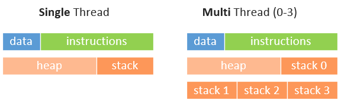

# Multi-Threading


**MUST SUMMARIZE:** https://www.bogotobogo.com/cplusplus/multithreaded.php


**Examples**

- [Singleton](http://www.modernescpp.com/index.php/thread-safe-initialization-of-a-singleton)

- [Thread-Safe Initialization of Data](http://www.modernescpp.com/index.php/thread-safe-initialization-of-data)

- Difficulties

- - Access to data from multiple threads must be properly synchronized.
  - Locks, lock-free programming Immutable data structures.
  - Deadlocks
  - Not all problems can be parallelized without making algorithms more complex.
  - Communication between threads
  - lock-free, starvation free, forward progress guarantee. memory_order in C++.


## Concepts and Terminology

**MUST SUMMARIZE:** https://www.bogotobogo.com/cplusplus/multithreaded.php





**Multiprocessing vs Multithreading**

1. Multiprocessing
   1. A process is the unit of resource allocation & protection.
   2. A process manages certain resources, e.g., virtual memory, I/O handlers, and signal handlers.
   3. **Pros**: Process is protected from other processes via an MMU.
   4. **Cons**: IPC between processes can be complicated and inefficient.
2. Multithreading
   1. A thread is the unit of computation that runs in the context of a process.
   2. A thread manages certain resources, e.g., stack, registers, signal masks, priorities, and thread-specific data
   3. **Pros**: IPC between threads is more efficient that IPC between processes.
   4. **Cons**: Threads can interfere with each other.


## Measuring Performance


## Other Concepts

- pipelining


## Std Lib Tools

### Threads

**std::thread**

```cpp

```

**std::thread::get_id**

```cpp

```


### Mutex Management

**std::lock_guard**

- guards for duration of scope
- locked once, unlocked at destruction

```cpp
std::mutex mutex;
int i = 0;
void safe_increment() {
    std::lock_guard<std::mutex> lock(mutex);
    ++i;
}
```

**std::unique_lock**

- general purpose mutex ownership wrapper
- can be unlocked/locked again (included delayed locking)
- unlocks by default upon destruction

```cpp
std::mutex mutex;
int i = 0;
void safe_increment() {
    {
        std::unique_lock<std::mutex> lock1;
        ++i;
    }
}
```


### Conditional Execution

**std::condition_variable**

Any thread waiting for the conditional variable has to:

1. acquire a `std::unique_lock<std::mutex>` on the same mutex as used to protect the shared variable
2. Execute `wait`, `wait_for`, `wait_until` which will automatically suspend the thread
3. The thread wakes up when:
   - The conditional variable is notified
   - A timeout expires
   - A spurious wakeup occurs

```cpp
std::mutex m;
std::condition_variable cv;
bool ready = false;

void do_work() {
    std::unique_lock<std::mutex> lk(m);
    cv.wait(lk, []{return ready;});
}

int main() {
    std::thread worker(do_work);
    {
        // do stuff before worker thread
        std::lock_guard<std::mutex> lk(m);
        ready = true;
    }
    // wake worker up
    cv.notify_one();
    worker.join();
}
```


## Futures

- Read-only container for result that does not yet exist
- Provides mechanism to access result of async operation


```cpp
std::future<int> future = std::async(std::launch::async, [](){
    std::this_thread::sleep_for(std::chrono::seconds(5));
    return 42;
});
// wait until result is available
int val = future.get();
```


**Waiting for results**

- `wait()`
- `wait_for(duration)`
- `wait_until(timepoint)`
- `valid()` returns `false` if future has already been consumed (through `get()`)


**Example:** Spawning multiple tasks

```cpp
std::vector<std::future<size_t>> futures;
for (size_t i = 0; i < 10; ++i) {
    futures.emplace_back(std::async(std::launch::async, [](size_t param){
        std::this_thread::sleep_for(std::chrono::seconds(param));
        return param;
    }, i));
}
std::cout << "Start querying" << std::endl;
for (auto &future : futures) {
    std::cout << future.get() << std::endl;
}
```


**Example:** Check if future is ready

```cpp
template<typename R>
  bool is_ready(std::future<R> const& f)
  { return f.wait_for(std::chrono::seconds(0)) == std::future_status::ready; }
```


## Promises

> A facility to store a value that is later acquired asynchronously via a `std::future` object created by the `std::promise` object

- `std::promise` packages the result of an asynchronous operation
  - only meant to be used once
  - "push" end of a promise-future communication
- `std::future` provides access to the result of an asynchronous operation


```cpp
auto promise = std::promise<std::string>();
auto producer = std::thread([&]
                            {
                              promise.set_value("Hello World");
                            });
auto future = promise.get_future();

auto consumer = std::thread([&]
                            {
                              std::cout << future.get();
                            });
producer.join();
consumer.join()
```


## Atomics


#### Sequential Consistency


#### Acquire-Release Semantics


- see [Blog](http://www.modernescpp.com/index.php/acquire-release-semantic)


----------------

## Pitfalls of Multi-Threading

### Race Conditions

http://jakascorner.com/blog/2016/01/data-races.html


### Dead-Locks

http://jakascorner.com/blog/2016/01/deadlock.html


-----------------


## Misc / Examples


**Lock and copy-return**

- Mutex object will always be destroyed **after** the return expression has **copy-initialized the return value.**


