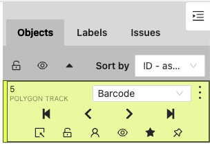

# CVAT

- a complete tutorial: https://www.v7labs.com/blog/cvat-guide

- why CVAT? https://viso.ai/computer-vision/cvat-computer-vision-annotation-tool/
- CVAT with FiftyOne: https://towardsdatascience.com/tools-to-annotate-and-improve-computer-vision-datasets-f9b99cdb0e04


## Getting started

> Guide for local setup

1. Clone repo and start the cvat services through docker compose

```bash
git clone https://github.com/opencv/cvat
cd cvat
docker compose up -d
```

2. Create an admin account (you will be asked to specify the user/password)

```bash
docker exec -it cvat_server bash -ic 'python3 ~/manage.py createsuperuser'
```

3. Open the GUI

head to http://localhost:8080


## Controls

**Editing polygons**

- You should [shift+click] on an existing point of your polygon first. It will take you to the polygon editing view. Then you can add additional points to your polygon.

**Moving annotations**

- disable the pin annotation
- select the cursor tool [esc]
- click on the annotation and drag it




## Tutorials


### Mounting local datasets

1. create a docker volute called `cvat_share`:

   ```bash
   docker volume create --name cvat_share --opt type=none --opt device=/Users/anon/cvat_share  --opt o=bin
   ```

2. create a `docker-compose.override.yml` file with the following content (note that we're connecting `cvat_share` and then exposing it to django):

   ```yaml
   services:
     cvat_server:
       volumes:
         - cvat_share:/home/django/share:ro
     cvat_worker_import:
       volumes:
         - cvat_share:/home/django/share:ro
   
   volumes:
     cvat_share:
       external: true
   
   ```

3. When defining tasks, select "connected file share" - your shared folder will then appear there


### Implementing a custom annotation format

- instructions: https://opencv.github.io/cvat/docs/contributing/new-annotation-format/

1. Implement the annotation format in a new file under `cvat/apps/dataset_manager/formats`
2. Import it in the registry at  `cvat/apps/dataset_manager/formats/registry.py`
3. Rebuild the docker image

```bash
docker build -f Dockerfile.ui . --tag cvat/ui:dev
```

Or

4. Link the code into your container for local development

   in `docker-compose.yml` at the following to the `volumes` section after line 58:

   ```
   - ./cvat:/home/django/cvat
   ```

   


### Semi-automatic/automatic annotation

> Annotation helpers are deployed as FAS/serverless functions using Nuclio

- Introduction to AI/CV tools, see https://opencv.github.io/cvat/docs/manual/advanced/ai-tools/#trackers
- Install instructions: https://opencv.github.io/cvat/docs/administration/advanced/installation_automatic_annotation/
- Nuclio releases: https://github.com/nuclio/nuclio/releases
- Nuclio CLI download: https://github.com/nuclio/nuclio/releases/tag/1.8.14
- serverless tutorial: https://opencv.github.io/cvat/docs/manual/advanced/serverless-tutorial/
- see your installed models: http://localhost:8080/models?page=1


**01. Start the Docker image**

up

```bash
docker compose -f docker-compose.yml -f components/serverless/docker-compose.serverless.yml up -d
```

down

```bash
docker compose -f docker-compose.yml -f components/serverless/docker-compose.serverless.yml down
```

**02. Installing the `nuctl` command line tool**

- head over to the nuclio release page https://github.com/nuclio/nuclio/releases
- download `nuclt` with the same version as specified in `components/serverless/docker-compose.serverless.yml`
- change to executable using `chmod +x nuctl`
- move it into the `cvat` folder
- use it `./nuctl --help`

**03. Create a new project**

- `nuctl create project cvat`

**04. Launch a serverless function**

- display available functions: `nuctl get functions`
- Available models: https://github.com/opencv/cvat/tree/develop/serverless

**05. Check the Nuclio control panel** 

- Head to `http://localhost:8070`


**Example**: Yolo

```bash
./nuctl deploy --project-name cvat \
  --path serverless/openvino/omz/public/yolo-v3-tf/nuclio \
  --volume `pwd`/serverless/common:/opt/nuclio/common \
  --platform local
```

**Example:** Siamese tracker

```bash
./nuctl deploy --project-name cvat --path "./serverless/pytorch/foolwood/siammask/nuclio" --platform local
```


