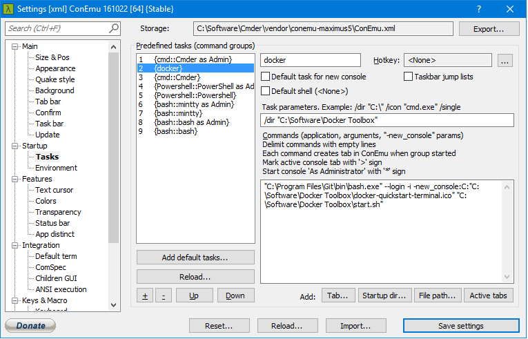

## 01. Installation


- Download Docker Toolbox for Windows


### Tweaks

**Run Docker in Cmder/ConEmu**



### Hosting
- dockerhub.com

### Commands
- [Links](https://docs.docker.com/engine/reference/commandline/)


## 02.Basics

**Image**
- Each Docker image references a list of read-only layers that represent filesystem differences.
- **Windows**: Docker needs Linux VM to manage Images - Docker images are stored (disk.vmdk) within a VirtualBox (boot2docker.img) VM at `%USERPROFILE%\.docker\machine\machines`


**Container**
- When you create a new container, you add a new, thin, writable layer on top of the underlying stack.
- All changes made to the running container - such as writing new files, modifying existing files, and deleting files - are written to this thin writable container layer.

_ _ _

#### 2.1 Boot2Docker

- Boot2Docker is a mini-vm running on VirtualBox to use Docker in Windows/OSX.
- The Docker Toolbox allows to setup Boot2Docker easily

**Start/Access/Stop Boot2Docker**
1. Start Boot2Docker: gitbash/CMDer/Console `docker-machine start`
2. SSH to Boot2Docker VM: `docker-machine ssh default`
3. Return to host console: `[CTRL]` + `[D]`

**Misc Commands**
- Boot2Docker IP: `docker-machine ip default`

**Handle Docker Containers**

1. Start Container:
	- Host (Windows) console: `winpty docker run -it my_image_name //bin/bash`

_ _ _

#### 2.2 Storage

**Data volumes**
- Volumes are initialized when a container is created. If the container’s base image contains data at the specified mount point, that existing data is copied into the new volume upon volume initialization. (Note that this does not apply when mounting a host directory.)
- Data volumes can be shared and reused among containers.
- Changes to a data volume are made directly.
- Changes to a data volume will not be included when you update an image.
- Data volumes persist even if the container itself is deleted.

_ _ _


#### 2.3 Examples (Windows)

##### 01. Setup Port Mapping with Boot2Docker

**Test Mapping**
1. Start nginx server with open port 80
```bash
winpty docker run --rm -i -t -p 80:80 nginx
```
2. Access from inside boot2docker
```bash
curl -I http://localhost:80/
```
3. Access from Host system
```bash
telnet localhost 80
```
_ _ _

##### 02. Start Docker Container

```bash
winpty docker run -p 9000:9000 -p 8000:8000 -t -i bamos/openface //bin/bash
```
- **Network Access**
    ```bash
    -p <port_in_container>:<equals_port_on_host>
    ```
- **Container Name**
    ```bash
    --name <your_custom_container_name>
    ```
- **Run Bash in Container**
	- Allocate a pseudo-tty
	- Keep STDIN open even if not attached
    ```bash
    -t -i //bin/bash
    ```
- **Run Python Script in Container**
    ```bash
    python app.py
    ```
_ _ _


##### 2.3 Networking with boot2docker
- boot2docker manages additional routing between VirtualBox system and the host system

1. Start Container
```bash
winpty docker run -it -p 80:80 matbloch/user_identification_node //bin/bash
```
1. List Containers
```bash
docker ps
```
2. Inspect Container
```bash
docker inspect f05e77f4897d
```

3. Get Container IP directly
```bash
docker inspect -f '{{ .NetworkSettings.IPAddress }}' f05e77f4897d
```
4. Ping Container from inside boot2docker
- from boot2docker shell, execute (172.17.0.2 is the container IP received in the last step):
```bash
ping 172.17.0.2
```

- Ping Boot2Docker from Host - OK
```bash
ping 192.168.99.100
```

- Ping Container from inside other container: OK
```bash
winpty docker run -it debian //bin/bash
ping 172.17.0.2
```
- Ping Container from inside other container by name: OK
```bash
winpty docker run -it --name deb_container debian //bin/bash
```

- Check if port is open
**Boot2Docker**:
```bash
winpty docker run -it -p 80:80 ubuntu
curl -I http://172.17.0.11:5050/
```
**Host**:
```bash
telnet 172.17.0.2 80
```

##### 2.4 Port Publishing

```bash
docker run -p 8888:8080 myimg
```
- Publish port 8080 of container to port 8888 on host

_ _ _

##### 03. Shared Directories
Shared Directories allow to share data between the host system and containers. When using boot2docker, the folders must first be shared with the mini-VM.

1. Open Virtualbox
2. Change shared folder of boot2docker to the target directory of your host system
3. Mount the folder in boot2docker (only certain folders are automounted!). Needs to be done at every start of boot2docker
4. Use `-v` at container start to mount the shared boot2docker folder a container (pre-existing content gets overloaded: accessible again if directory is unloaded)
    **Example:**`VM_share` is the shared-name of a folder set in VirtualBox, which will be loaded into `/dev` on the container.
    ```bash
    docker run -it -v /VM_share:/dev python /bin/bash
    ```


**Automounted Shared Folders**

Boot2Docker includes the VirtualBox Guest Additions built in for the express purpose of using VirtualBox folder sharing.
Automatic shared folder name mapping (VirtualBox shared name to Boot2Docker directory):

- Users share at /Users
- /Users share at /Users
- c/Users share at /c/Users
- /c/Users share at /c/Users
- c:/Users share at /c/Users

**Custom Folder Mounting**
Folders with other share names must be mounted manually in boot2docker on every startup.

1. SSH to boot2docker: `docker-machine ssh default`
2. Make shared folder inside boot2docker VM: `sudo mkdir /VM_share`
3. Mount Windows folder to it: `sudo mount -t vboxsf win_share /VM_share` (`win_share` is the share-name of the folder, set in the VirtualBox settings)

_ _ _

##### 04. Permanently running a container
- ...

## 03. Commands

- `[CTRL]` + `[D]` exit container bash
- `docker images` list all downloaded images
- `docker run image-name` load image `image-name` into new container (downloads it from dockerhub if not present)
- List active containers: `docker pl`
- To remove a container: docker rm <Container ID>
- To remove all containers: docker rm $(docker ps -a -q)
- To remove images: docker rmi <Container ID>
- To remove all images: docker rmi $(docker ps -a -q)


## 04. Automated Build: Docker Files


- `ADD <src> <dest>`

```bash


# run bash commands
RUN cd ~/openface && \
    ./models/get-models.sh && \
    pip2 install -r requirements.txt && \
    python2 setup.py install && \
    pip2 install -r demos/web/requirements.txt && \
pip2 install -r training/requirements.txt

# execute script through bash
CMD /bin/bash -l -c '/root/openface/demos/web/start-servers.sh'
```

#### Adding Files to the Image

**Add shared folder of boot2docker**
`VM_share` is the folder name in boot2docker
```
ADD /VM_share /my_projects
```


## 05. Other Tutorials

- [Containerize Python Web Application](https://www.digitalocean.com/community/tutorials/docker-explained-how-to-containerize-python-web-applications)
