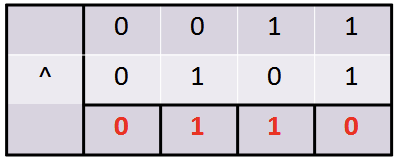

# Bit Operations

> See also [Bit Hacks](./Bit Hacks.md)

```
&   -  bitwise and
|   -  bitwise or
^   -  bitwise xor
~   -  bitwise not
<< -  bitwise shift left
>>  -  bitwise shift right
```


## XOR (`^` ) - Exclusive OR

- = `1` if **one** of the bits is `1` but **not both**




## AND (`&`)


## Bit Shifting

**Aritmetic vs Logical shifting**

- Arithmetic
  - Preserves the sign of the original number when shifting to right (sign bit is replicated). 
  - Aritmetic `>>` can be interpreted as **division by 2**
- Logical 
  - 0 padding on right shift


**Right Shifts**

- To handle signed numbers:
  - padd by `0` for unsigned numbers, by the `sign bit` for signed numbers (see example below)
  - **NOTE**: Some compilers might not fill with the sign bit, it is not guaranteed. Vary rare though.


**Example**: `-16 << 1`

-16 in binary representation:

- 16:              `0000 0000 0001 0000`
- inverted:    `1111 1111 1110 1111`
- Add 1:        `1111 1111 1111 0000` = -16

Shift the bits by padding with the sign bit:

- Shift by 1:  `1111 1111 1111 1000`

Interpret as a positive number (easier to read):

- To positive: `0000 0000 0000 1000` = 8, hence `-16 << 1 == -8`


**Left Shifts**

- **NOTE:** right-shift a 32bit variable by 32 or more bit is undefined behavior
- most of the time the output will be 0 (if `int` is 32 bits or less) since you're shifting the 1 until it drops off again and nothing but 0 is left. But the compiler may optimize it to do whatever it likes.
