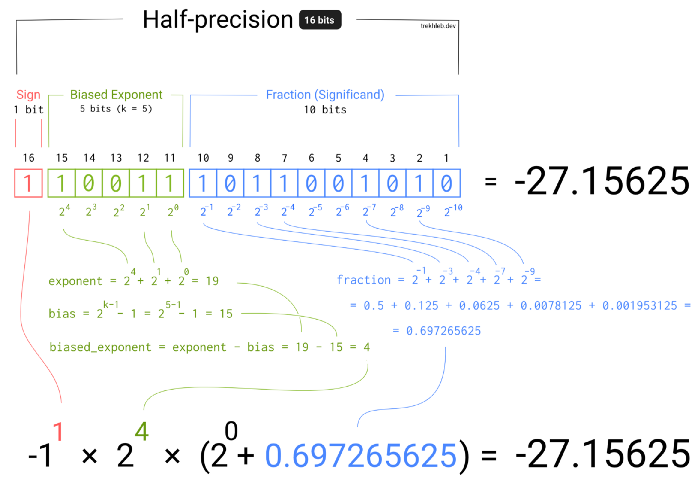

# Representation of Numbers

**Resources**

- Hardware implementation of binary operations: https://www.electronics-tutorials.ws/binary/signed-binary-numbers.html


## Binary Representation

> Uses base `2` instead of e.g. the commonly used base `10` for decimal numbers.


**Decimal numbers (base 10)**

- each character in encoding can hold 10 states (`0..9`)

$$
125_{10}=\textbf{1} * 10^2 + \textbf{2} * 10^1 + \textbf{5} * 10^0 = 125
$$

**Binary numbers (base 2)**

- each character can in encoding can hold 2 states (`0..1`)
- **NOTE:** always start with the highest divisor (`16` in this case. `32` is too large.). Then fill up.

$$
18_{2}=\textbf{1} * 2^4 + \textbf{0} * 2^3 + \textbf{0} * 2^2 + \textbf{1} * 2^1 + \textbf{0} * 2^0 = 10010
$$


**Signed and unsigned integers**

- **Negative numbers**: left-most bit indicates sign
  - if `0`: positive, if `1`: negative


**Convert positive <> negative numbers**

> NOTE: Applies both ways

1. invert all bits
2. add 1

**Example**:

35        = 0010 0011
invert -> 1101 1100
add 1 -> 1101 110**1** = -35


**Extending the number of bits used**

> Known as **sign-extension**. Number needs to be represented by a larger number of bits. E.g. when moving a number from a 16 bit register to a 32 bit register.

- extend left-most bit

**Example**: 

​          1011 = -8 + 2 + 1 = -5

**1111** 1011 = -128 + 64 + 32 + 16 + 8 + 2 + 1 = -5


### Basic Operations

**Binary Addition**


**Binary Subtraction**


**Binary Multiplication**


## Floating Point Numbers





## Bit Operations

> See also [Bit Hacks](./Bit Hacks.md)

```
&   -  bitwise and
|   -  bitwise or
^   -  bitwise xor
~   -  bitwise not
<< -  bitwise shift left
>>  -  bitwise shift right
```


- arithmetic right shift: shifts right and fills with left-most bit


### Bit Shifting


**Right Shifts**

> Move bits to the right and pad to the left. Can be interpreted by **division by 2** (arithemtic shift).

- To handle signed numbers:
  - padd by `0` for unsigned numbers, by the `sign bit` for signed numbers (see example below)
  - **NOTE**: Some compilers might not fill with the sign bit, it is not guaranteed


**Example**: `-16 << 1`

-16 in binary representation:

- 16:              `0000 0000 0001 0000`
- inverted:    `1111 1111 1110 1111`
- Add 1:        `1111 1111 1111 0000` = -16

Shift the bits by padding with the sign bit:

- Shift by 1:  `1111 1111 1111 1000`

Interpret as a positive number (easier to read):

- To positive: `0000 0000 0000 1000` = 8, hence `-16 << 1 == -8`


**Left Shifts**


### Arithmetic vs Logical Shift


**logical shift**

- does not preserve sign bit


## Grouping of Bits

> Often, it is more convenient to handle groups of bits, rather than individually. The most common grouping is 8 bits = 1 byte.

- **bit**: 0 or 1
- **byte**: 8 bits, range: $2^8=[0...255]$


## Hexadecimal Representation

> A representation of **4 bits by a single digit 0..9, A..F**. In this way **1 byte** can be represented **by two hexadecimal digits**. For humans more inutivie way to writing, reading, and remembering individual bits.

- 4 bits used to represent a single digit
  - **problem:** 4 bits allow for $2^4=16$​ combinations but there are only 10 unique decimal digits $0...9$​​
  - **solution:** use first 6 letters $A..F$​ of the alphabet as well


**Example**

`CA3` = `1100` `1010` `0011`  (1100 = C16 , 1010 = A16, 0011 = 3 16)


| Code   | Byte value | Decimal value | Hexadecimal value |
| ------ | ---------- | ------------- | ----------------- |
| `11`   | 00001011   | 11            | B                 |
| `0x11` | 00010001   | 17            | 11                |
| `B11`  | 00000011   | 3             | 3                 |


## Endianness

> Ordering of bytes when processor stores data from register into memory

- Big-endian: Start storing with **most-significant** bit
- Little-endian: Start storing with **least-significant** bit


**When to care about Endianness?**

- transferring files between processors that use a different system
- send bytes over network (e.g. TCP/IP is defined to be big-endian)

