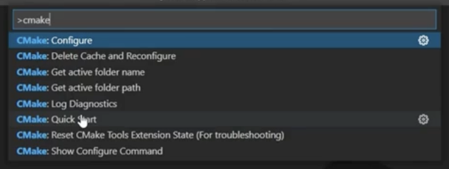

# Visual Studio Code

### Required plugins

- 

### 02. Configuring your build with CMake

1. Install dependencies
   - Install `CMake Tools` by Microsoft
2. Bring up command pallet
   - [CMD] + [Shift] + [P] or select input bar at top and type `>`
   - Select `> CMake: Quick Start`

### 02. Building the project

- 

Install dependencies

- Install `C++ Tools` by Microsoft

- selecting a build target

### CMake Presets

- Contains e.g. generator
- Loaded from `CMakePresets.json`

- .json file

