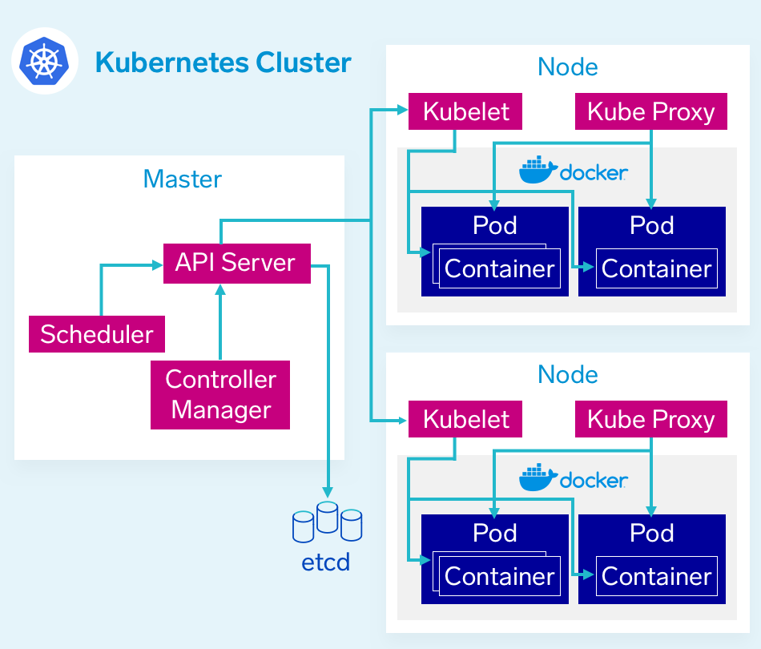

# Kubernetes

> Container orchestration and distributed deployment

**Architecture**

1. **The Control Plane** - The Master
2. **Nodes** - Where pods get scheduled
   - Physical infrastructure where containers actually get deployed
3. **Pods** - Holds containers
   - Made up of one or more containers (most commonly 1)
   - Pod limits for CPU and Memory are defined on cluster setup which defines on which nodes to place them (if more containers in single pod, it's more difficult to estimate the required resources)

#### Docker vs Kubernetes

### Deployment on AWS: ECS vs EKS

https://www.missioncloud.com/blog/amazon-ecs-vs-eks-which-service-is-right-for-you

