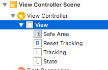
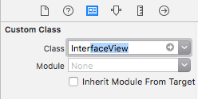
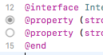
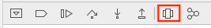
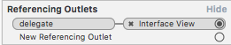
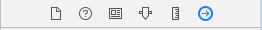
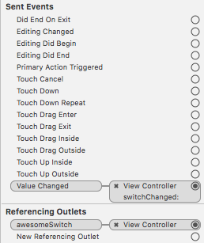
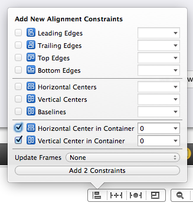
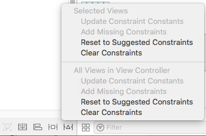

# iOS Application Development in Objective C


## Project Structure

```bash
- YourApplication
    AppDelegate.h / .m			// app launch points
    ViewController.h / .m       // view controller
	Main.storyboard		        // view
```

**Default iPhone App Flow**
`AppDelegate (Object) > View Controller (Object) > View Controller (View)`


- `AppDelegate` Creates a ViewController object when app is launched
- `ViewController` Sets up the view described in `Main.storyboard` and shows it on the screen


## The Storyboard
- The storyboard (default: `Main.storyboard`) shows all the contents of the scenes
	- set in `info.plist` "Main storyboard file base name"
	- or in settings: "Project Settings > General > Deployment Info"

**Switching the Storyboard View**
- e.g. Display code and UI layout side by side


**Default Scene Contains:**
- View Controller
- First Responder
- Exit


**Scene Dock**
- Miniature version of the document outline


## View Controllers
- manages user interface and interaction between interface and data
- base class: `UIViewController`

**Example View Controller**
```cpp
@interface ViewController : UIViewController
@end
```

#### View Controller Types

**Regular View Controller**

**Container View Controller**
- Example: Tab Bar
- Contains multiple sub-views


## Views
- Views created in the storyboard are automatically initiated (no need to init them in view controller code)
- Custom view classes can be selected to implement the UI callbacks
- All outlets that connect storyboard elements to code are marked with `IBOutlet`

**Creating callbacks for storyboard views**

0. Create a custom view class in code
``` cpp
@interface InterfaceView : UIView
@end
```
1. Click on view

2. Select view class that implements the callbacks from attributes tab

3. Connect your outlets to the UIView subclass in the code (right-click drag and drop)

**Reconnecting Code Callbacks to Storyboard**
- Code Outlets are marked with dots. Connected ones are filled.
- Available outlets are also visible in the view property tab of the storyboard
- Right-click drag & drop from code dot to storyboard element


**Debugging UIView order**


**Connecting Storyboard View delegates**
- Create custom view class and delegate property
```cpp
@property (nonatomic, weak) IBOutlet id <InterfaceViewDelegate> delegate;
```
- drag&drop property onto view controller in storyboard
- The delegate will appear in the property tab of the view controller (in the storyboard)



# Tutorial: Creating an Application

## 0. Terminology

**Scene**
- represents one screen of content and (typically) one view controller

**View Controller**
- Implements app's behaviour
- Manages single content view with its hierarchy of subviews
- All view controllers are of type `UIViewController` or one of its subclasses

**Storyboard**
- Visual compositor for the UI
- Connection between the defined code (view controller) and the UI is defined here

**Outlets**
- reference interface objects from the storyboard in source code files
- Storyboard UI Element <-> code link

## 1. Create a new project from an XCode Template
Project structure:

- YourApp
    - `AppDelegate.h/.m	` default application launch point, no content
    - `Main.storyboard`	 the main view/scene overview
    - `LaunchScreen.storyboard` view/scene for the launch screen
    - `info.plist`  project settings (requirements, storyboard selection, app identifier)
    - `main.m` launches the application with `AppDelegate`

## 2. Specify Storyboards

- open `info.plist` and select the storyboard files in "Main storyboard file..." and "Launch screen interface file..."
- Select the project, go the "General" tab and select the main storyboard file in the section "Deployment Info" under "Main interface"

## 3. Add View Controller to Storyboard

- Open `Main.storyboard`
- Select *Object Library* and drag&drop **"View Controller"** into scene


## 4. Add View Controller Source

**ViewController.h**
```cpp
#import <UIKit/UIKit.h>
@interface ViewController : UIViewController
@end
```

**ViewController.m**
```cpp
#import "ViewController.h"

@implementation ViewController
- (void)viewDidLoad {
  [super viewDidLoad];
}
@end
```


**Connecting View Controller to Storyboard**

- Switch to Storyboard and select the *View Controller* in the scene content
- Select identity inspector and select the controller class `ViewController` that was created in the code


**Select Initial View Controller**
- Select view controller in storyboard and check **Is Initial View Controller**


## 5.1 Adding Storyboard View
- Drag&Drop View element from objects library onto view controller in storyboard

**Adding code callbacks**

- Create new `UIView` child class

```cpp
@interface MyView : UIView
@end
@implementation MyView
@end
```
- Switch to storyboard, select the view and switch to "Identity Inspector" Tab
- Select the new class `MyView` as the *Custom Class*

## 5.2 Adding Programmatic View

- Create new `UIView` child class
- Create view instance in view controller

```cpp
@interface ViewController
    @property (strong, nonatomic) MyView *myView;
@end
@implementation ViewController
- (void)viewWillAppear:(BOOL)animated {
	self.myView = [[MyView alloc] init];
}
@end
```

## 6. Adding UI Elements

**Adding Elements from Storyboard**
- Drag&Drop elements from object library into a view
- Switch to implementation of the target view
- Drag&Drop UI elements from storyboard into code
	- Connections will appear as "dots" in the code
	- Also visible in properties tab of UI element in storyboard

**Connecting Storyboard UI Elements**
- Right-click drag&drop UI element from Storyboard into `@interface` section of `ViewController.m`
- Ensure that the outlets are configure correctly:
	- Select UI element in storyboard and select the connection inspector



**Programmatic UI Elements**
- All UI elements can also be added through code


# UI Elements

## Switch

- Add switch to Storyboard
- **Link switch state**: Right-Click drag&drop into `@interface` section of `ViewController.m` (current scene view controller)
- **Link action**: Right-Click drag&drop into `@implementation` section
	- From the context menu, select the preferred action ()

```cpp
@interface ViewController () <ARSCNViewDelegate>
// state
@property (weak, nonatomic) IBOutlet UISwitch *awesomeSwitch;
@end

// action
@implementation ViewController
- (IBAction)switchPressed:(id)sender {
}
@end
```

**Verify view controller outles:**
- Go to Storyboard, select switch




## Button

**Add button programatically**
```cpp
UIButton *button = [UIButton buttonWithType:UIButtonTypeCustom];
[button addTarget:self
           action:@selector(aMethod:)
 forControlEvents:UIControlEventTouchUpInside];
[button setTitle:@"Show View" forState:UIControlStateNormal];
button.frame = CGRectMake(80.0, 210.0, 160.0, 40.0);
[view addSubview:button];
// bring button to front
[view bringSubviewToFront:button];
```


## ARKit SceneKit View

- In the Storboard, add "ARKit SceneKit View" to a view
- **Link AR View**: Drag&drop view onto `@interface` section
- **Configure tracking**: In standard view controller method `(void)viewDidLoad`
- **Start tracking**: In standard view controller method `(void)viewWillAppear`
- **Pause tracking**: In standard view controller method `(void)viewWillDisappear`


```cpp
@interface ViewController () <ARSCNViewDelegate>
// the AR view
@property (strong, nonatomic) IBOutlet ARSCNView *sceneView;
@end
```


**View loaded: Configure tracking**

```cpp
- (void)viewDidLoad {
    [super viewDidLoad];
    // Set the view's delegate
    self.sceneView.delegate = self;
    // Show statistics such as fps and timing information
    self.sceneView.showsStatistics = YES;
    // Create a new scene
    SCNScene *scene = [SCNScene sceneNamed:@"art.scnassets/ship.scn"];
    // debug options
    self.sceneView.debugOptions =
    ARSCNDebugOptionShowWorldOrigin |
    ARSCNDebugOptionShowFeaturePoints;
    // Set the scene to the view
    self.sceneView.scene = scene;
}
```

**View appear: Run tracking session**
```cpp
- (void)viewWillAppear:(BOOL)animated {
    [super viewWillAppear:animated];
    // Create a session configuration
    ARWorldTrackingConfiguration *configuration = [ARWorldTrackingConfiguration new];
    // Run the view's session
    [self.sceneView.session runWithConfiguration:configuration];
}
```

**View disappear: Pause tracking session**
```cpp
- (void)viewWillDisappear:(BOOL)animated {
    [super viewWillDisappear:animated];
    // Pause the view's session
    [self.sceneView.session pause];
}
```

## Element Constraints
**Add new constrainsts**
- Instead of fixed location on screen


**Adding Missing Constraints automatically**



# Deployment

**Deployment iOS Version**
- Go to project settings > Build Settings > Deployment
- Set iOS Deployment Target to the device iOS version


# UIView

```cpp
@interface ViewController () <TrackingControllerDelegate>
@property (strong, nonatomic) UIImageView *imageView;
@end
```

**initialization & frame size**
```cpp
_imageView = [[UIImageView alloc] init];
// define frame
_imageView.frame = _sceneView.frame;
```

**Container Scaling**
```cpp
_imageView.contentMode = UIViewContentModeScaleToFill;
_imageView.autoresizingMask = UIViewAutoresizingFlexibleWidth | UIViewAutoresizingFlexibleHeight;
```


**Image Orientation**


### Handling Device Rotation

- [Tutorial](https://happyteamlabs.com/blog/ios-using-uideviceorientation-to-determine-orientation/)


# ARKit Application

#### Initialization

```cpp
@interface <your view controller name>()
@property (nonatomic, strong) ARSession *session;
@end


// then somewhere in your implementation block...
// official example shows you ought to declare the session in viewWillLoad and initialize in viewWillAppear but it probably doesn't matter.
self.session = [ARSession new];

// World tracking is used for 6DOF, there are other tracking configurations as well, see
// https://developer.apple.com/documentation/arkit/arconfiguration
ARWorldTrackingConfiguration *configuration = [ARWorldTrackingConfiguration new];

// setup horizontal plane detection - note that this is optional 
configuration.planeDetection = ARPlaneDetectionHorizontal;

// start the session
[self.session runWithConfiguration:configuration];
```


# Gesture Recognition


**Propagating Clicks through transparent Views**

- Create a custom subclass  of `UIView` and assign it to the transparent click-through view
- implement the method `pointInside` which passes the clicks to underlying views if it does not hit a subview (e.g. button)
```cpp
-(BOOL)pointInside:(CGPoint)point withEvent:(UIEvent *)event {
    for (UIView *view in self.subviews) {
        if (!view.hidden && view.userInteractionEnabled && [view pointInside:[self convertPoint:point toView:view] withEvent:event])
            return YES;
    }
    return NO;
}
```


# Profiling


