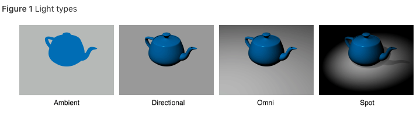

# SceneKit

## General


**Removing SCNNode's**
`[thisNode removeFromparentNode]`


## Glossary

- Node:
	- represents an object that can be added to the scene
	- can be composites (extend `SCNNode class`)
- Material:

## Matrix Operations
**SCNMatrix4**
- `SCNMatrix4Mult(Mat1, Mat2)`
- `SCNMatrix4FromMat4(Mat)`
	- `Mat`: Mat4x4


**matrix_float_4x4**

- `matrix_multiply(m1, m2)`
```cpp
// Create a transform with a translation of 0.2 meters in front of the camera
matrix_float4x4 translation = matrix_identity_float4x4;
translation.columns[3].z = -0.2;
matrix_float4x4 transform = matrix_multiply(currentFrame.camera.transform, translation);
```

## Scene Nodes

```cpp
matrix_float4x4 transform;
node.simdTransform = transform;
node.transform = SCNMatrix4FromMat4(transform);
```

## Materials - `SCNMaterial`


```cpp
SCNMaterial *simple_material = [SCNMaterial new];
simple_material.diffuse.contents = [UIColor colorWithRed:66.0f/255.0f
                                    green:79.0f/255.0f
                                    blue:91.0f/255.0f
                                    alpha:1.0f];
```


**Render as Wireframe**


```cpp

SCNGeometry* sphere = [SCNSphere sphereWithRadius:0.002];
sphere.firstMaterial.fillMode = SCNFillModeLines;
```

## Geometry

- `SCNPlane`
- `SCNSphere`
- `SCNBox`
- `SCNPyramid`
- `SCNTube`


## Lights





