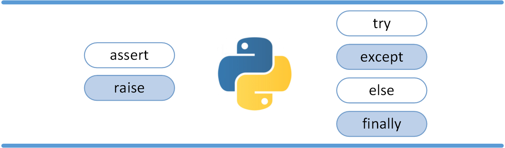

# Errors and Exceptions




**Sources**

- raising/throwing: https://realpython.com/python-exceptions/#exceptions-versus-syntax-errors


## Exceptions


### Throwing


### Catching


```python
try:
    x = int(input("Please enter a number: "))
    y = 100 / x
except ValueError:
    print("Error: there was an error")
except ZeroDivisionError:
    print("Error: 0 is an invalid number")
except Exception:
    print("Error: another error occurred")
finally:
    print("Cleanup can go here")
```


### User-Defined Exceptions

- derive from `Exception` class


```python
class CustomError(Exception): 
    def __init__(self, value): 
        self.value = value
    def __str__(self): 
        return "Error: %s" % self.value
```


## Alternatives


**Using Exceptions for Control Flow**

- Exception could be costly
- Use for events “out-of-the-ordinary”