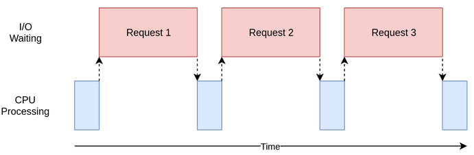
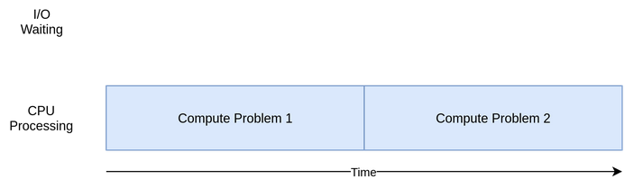

# Concurrency and Parallelism

- source: https://realpython.com/python-concurrency/


**Multi-processing tools in Python**

- `threading` The operating system knows about each thread and can interrupt it at any time to start running a different thread
- `asyncio` The tasks must cooperate by announcing when they are ready to be  switched out. That means that the code in the task has to change  slightly to make this happen.
- `multiprocessing` Run code on multiple cores (new Python interpreter instance on each CPU)

| Concurrency Type                       | Switching Decision                                           | Number of Processors |
| -------------------------------------- | ------------------------------------------------------------ | -------------------- |
| Pre-emptive multitasking (`threading`) | The operating system decides when to switch tasks external to Python. | 1                    |
| Cooperative multitasking (`asyncio`)   | The tasks decide when to give up control.                    | 1                    |
| Multiprocessing (`multiprocessing`)    | The processes all run at the same time on different processors. | Many                 |


**concurrency vs parallelism**

- **Concurrency**: run code independently of other code - when code is blocked in script 1, script 2 is executed
  - Useful to break things apart. Schedule and manage different parts
  - Greenlets perform scheduling of calls that would block the current thread
  - Performs especially well in I/O, networking apps with waiting time
- **Parallelism**: Execution of concurrent code simultaneously
  - Useful to do a lot of resource intensive work
  - Threads: Expensive in terms of virtual memory and kernel overhead


## Identifying Bottlenecks

**Problem types**

- I/O bound: 

  - Spend most of time waiting for external operation (e.g. network call)
  - Speedup involves overlapping the times spent waiting

- CPU-bound: 

  - Program spends most of time doing CPU operations

  - Speedup by doing more computation in the same amount of time

    

I/O-bound task:



CPU-bound task:




If your code is IO bound, both multiprocessing and multithreading in  Python will work for you. Multiprocessing is a easier to just drop in  than threading but has a higher memory overhead. If your code is CPU  bound, multiprocessing is most likely going to be the better  choice—especially if the target machine has multiple cores or CPUs. For  web applications, and when you need to scale the work across multiple  machines, RQ is going to be better for you.


## Threading

- lighter than processes
- share same memory space

- The threads may be running on different processors, but they will only be running one at a time. 


```python
import threading

process = threading.Thread(target=thread_function, args=(1,))
process.start()

# block until done
process.join()
```

**Daemon Threads**

- run in the background
- will be killed when main program ends


### ThreadPoolExecutor

```python
import concurrent.futures

with concurrent.futures.ThreadPoolExecutor(max_workers=3) as executor:
    executor.map(thread_function, range(3))
    # "with" context is blocked till all tasks have been terminated
```


**Example:** Producer-Consumer Pattern

```python

```


### Locks

- `threading.Lock`

  

```python
class FakeDatabase:
    def __init__(self):
        self.value = 0
        self._lock = threading.Lock()
        
    def locked_update(self, name):
        with self._lock:
            self.value += 1
            
    # alternative
    def locked_update2(self, name):
        self._lock.acquire()
        self.value += 1
        self._lock.release()
```


## Multiprocessing

- Run code on multiple cores (new Python interpreter instance on each CPU)


## Subprocess


```python
from subprocess import Popen, PIPE

process = Popen(['swfdump', '/tmp/filename.swf', '-d'], stdout=PIPE, stderr=PIPE)
stdout, stderr = process.communicate()

print("retcode =", process.returncode)
```


# Gevent - Greenlets

The core idea of concurrency is that a larger task can be broken down into a collection of subtasks which are scheduled to run simultaneously or asynchronously, instead of one at a time or synchronously.

- Greenlets: Alternative to parallel process. Greenlets all run inside of the OS process for the main program but are scheduled cooperatively

## Spawning

```python
import gevent
from gevent import Greenlet

def foo(message, n):
    """
    Each thread will be passed the message, and n arguments
    in its initialization.
    """
    gevent.sleep(n)
    print(message)

# Initialize a new Greenlet instance running the named function
# foo
thread1 = Greenlet.spawn(foo, "Hello", 1)

# Wrapper for creating and running a new Greenlet from the named
# function foo, with the passed arguments
thread2 = gevent.spawn(foo, "I live!", 2)

# Lambda expressions
thread3 = gevent.spawn(lambda x: (x+1), 2)

threads = [thread1, thread2, thread3]

# Block until all threads complete.
gevent.joinall(threads)
```

## Events

- Asynchronous communication between Greeenlets
- E.g. Greenlets wait till Greenlet XY reaches certain state

```python
import gevent
from gevent.event import Event


evt = Event()

def setter():
    '''After 3 seconds, wake all threads waiting on the value of evt'''
    print('A: Hey wait for me, I have to do something')
    gevent.sleep(3)
    print("Ok, I'm done")
    evt.set()


def waiter():
    '''After 3 seconds the get call will unblock'''
    print("I'll wait for you")
    evt.wait()  # blocking
    print("It's about time")

def main():
    gevent.joinall([
        gevent.spawn(setter),	# sets evt in 3 sec
        gevent.spawn(waiter),	# waits till evt is set
        gevent.spawn(waiter),	# ...
        gevent.spawn(waiter),	# ...
        gevent.spawn(waiter),
        gevent.spawn(waiter)
    ])

if __name__ == '__main__': main()
```


