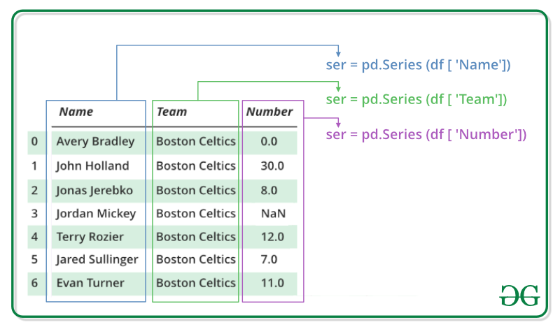

# Pandas

- [Introduction](https://www.geeksforgeeks.org/python-pandas-dataframe/)


## 01. Series

- see [introduction](https://www.geeksforgeeks.org/python-pandas-series/)




### Initialization

**From Array**

```python
data = np.array(['g','e','e','k','s'])
data = ['g', 'e', 'e', 'k', 's']
series = pd.Series(data)
```

**With Indices**

```python
data = np.array(['g','e','e','k','s','f', 'o','r','g','e','e','k','s'])
series = pd.Series(data,index=[10,11,12,13,14,15,16,17,18,19,20,21,22])
```


### Accessing Data

```python
series[:5]
```

### Naming

```python
my_series.name
my_series.rename("new_name")
```


****

**Dataframe` from Dict with `Series`**

```python
In [1]: s1 = pd.Series([1, 2], index=['A', 'B'], name='s1')
In [2]: s2 = pd.Series([3, 4], index=['A', 'B'], name='s2')
In [3]: pd.concat([s1, s2], axis=1)
Out[3]:
   s1  s2
A   1   3
B   2   4
```

### Manipulation

```python
In [1]: my_series.tolist()
```


## 02. Dataframe

### Initialization

**From list**

```python
import pandas as pd
lst = ['Geeks', 'For', 'Geeks', 'is', 
            'portal', 'for', 'Geeks']
df = pd.DataFrame(lst)
```

**From Dict  - without rows**

```python
import pandas as pd
data = {'Name':['Tom', 'nick', 'krish', 'jack'],
        'Age':[20, 21, 19, 18]}
df = pd.DataFrame(data)
```

result:

```
     Name  Age 
0    Tom   20
1    nick  21
2    krish 19
3   jack   18

**From Dict - with rows**

​```python
data = {'Name':['Tom', 'Jack', 'nick', 'juli'],
        'marks':[99, 98, 95, 90]}
df = pd.DataFrame(data, index =['rank1',
                                'rank2',
                                'rank3',
                                'rank4'])
```


```
         Name    marks 
rank1    Tom     99
rank2    Jack    98
rank3    nick    95
rank14   juli    90
```


### Indexing

- **`Dataframe.[ ]`**This function also known as indexing operator
- **`Dataframe.loc[ ]`** for labels
- **`Dataframe.iloc[ ]`** for positions or integer based
- **`Dataframe.ix[]`**  for both label and integer based

##### **[]** Indexer Operator

- Single/list selections

##### .loc[] Operator

- internally uses indexer operator
- allows subqueries and result composition

##### .iloc[] Operator

- internally uses indexer operator

##### .ix[] Operator


### Misc Methods

- `df.empty`


### Grouping

```python
df = pd.DataFrame({'Animal': ['Falcon', 'Falcon','Parrot', 'Parrot'],
                   'Max Speed': [380., 370., 24., 26.]})
grouped: pd.DataFrameGroupBy = df.groupby(['Animal'])

# get a specific group
grouped.get_group('Falcon')


df_list  = map(lambda df_i: grouped.get_group(df_i), sampled_df_i)
sampled_df = pd.concat(df_list, axis=0, join='outer')
```


### Row/Column Selection

**Column Selection**

```python
columns = ['Name', 'Qualification']
df[columns]
```

**Column Names**

```python
# iterating the columns 
for col in data.columns: 
    print(col) 
# 1
column_names = list(data.columns) 
# 2
column_names = list(data.columns.values)
# 3
column_names = list(data.columns.values.tolist())
```

**Row Selection**

```python
# by value
row = df.loc["Avery Bradley"]
# by row index
row = df.iloc[3]
```

**Row Names**

```python
# iteration
for row in data.index: 
    print(row, end= " ") 
# 1
data_top = data.head() 
row_names = list(data_top.index)
```


### Slicing and Data Access

**Slicing rows**

```python
# by integer
dataframe[0]
dataframe[0:3]
dataframe[-1:]

# by condition: df[{condition}]
df[df.A > 3]
```


**Slicing rows AND columns**

- `iloc` integer based indexing
- `loc` label based indexing

```python
# iloc[row slicing, column slicing]
dataframe.iloc[0:3, 1:4]
dataframe.loc[[0, 10], :]
dataframe.loc[0, ['species_id', 'plot_id', 'weight']]
dataframe.loc[[0, 10, 35549], :]
```

**Serie from column/row**

- slicing with a single row/column

```python
df.iloc[:,0]
```


### Iterating

```python
columns = list(df)
for i in columns:
    # printing the third element of the column
    print (df[i][2])
```


### Joining Dataframes

- [reference](https://pandas.pydata.org/pandas-docs/stable/user_guide/merging.html)


**Appending Rows**

- Same columns

```python
result = df1.append(s2, ignore_index=True)
```

**Concatenate**

```python
frames = [df1, df2, df3]
result = pd.concat(frames, axis=1)
```

**Concatenate List of Dataframes**

```python
df = pd.concat(list_of_dataframes)
```

**Merging**

```python

```


### Sorting

**Sorty by Column/Row names**

```python
df.sort_index(axis = 0)
```


### Manipulating Dataframes

**Flip Rows and Columns**

```python
d1 = {'col1': [1, 2], 'col2': [3, 4]}
d2 = d1.transpose()
```

**Renaming Columns/Rows**


**Set column as Row index**

```python
df = df.set_index('YourColumnName') 
```


### Adding Data


### Filtering


**by column value**

```python
df = df[df['my_value'] > 0]
```

**by column regex**

```python
df.filter(regex='e$', axis=1)
```

**by multiple column values**

```python
df = df[df['id'].isin([1,6])]
```

**by multiple columns**

```python
 df[(df["Name"]=="Tom") & (df["Age"]==42)]
```

```python
df[(df["Name"]=="Tom") | (df["Age"]==34)]
```

**Row-wise custom filter**

```python
df[df.apply(lambda x: x['b'] > x['c'], axis=1)]
```


### Aggregation

**Group by Column value and then merge**

```python
aggregation_functions = {'price': 'sum', 'amount': 'sum', 'name': 'first'}
# group all rows by unique column value pairs
df = df.groupby(["name", "surname"])
# aggregate the groups
df_new = df.aggregate(aggregation_functions)
```


## Storing / Loading


### Loading From Files

```python
data = pd.read_csv("nba.csv", index_col ="Name")
```


## Plotting


### Matplotlib

```python
import matplotlib.pyplot as plt
df.plot(kind='scatter',x='num_children',y='num_pets',color='red')
plt.show()
```

