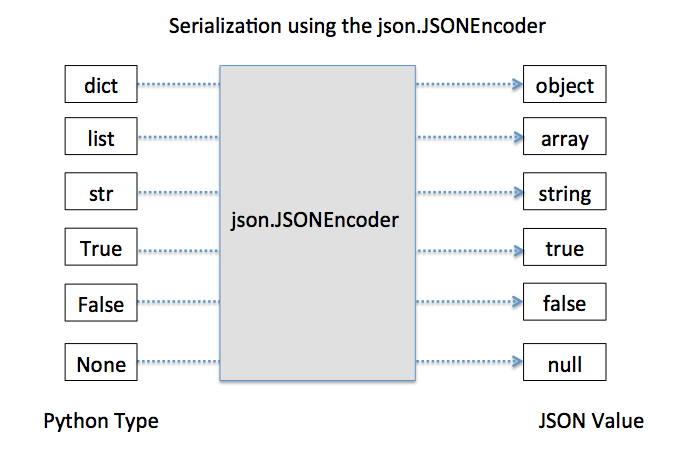

# Serialization


## JSON


### Encoding of Primitives


**Encoding**

```python
jsonString  = json.dumps(repDigits)
```

**Decoding**

```python
json.loads('{ "active": true, "age": 78, "balance": 345.8,   "friends": ["Jane","John"], "name": "Foo Bar", "other_names": ["Doe","Joe"],"spouse":null}')
```





### Serializing Classes

```python
class EncodableMixin:
    def to_json(self) -> str:
        return json.dumps(self, default=lambda o: o.__dict__, sort_keys=True)

    @classmethod
    def from_json(cls, json_string: str):
        j = json.loads(json_string)
        return cls(**j)


class MyClass(EncodableMixin):
    def __init__(self, filename: str, meta: dict = None):
        self.filename = filename
        self.meta = meta
```


## Pickle

*“Pickling”* is the process whereby a Python object hierarchy is converted into a byte stream, and *“unpickling”* is the inverse operation, whereby a byte stream (from a [binary file](https://docs.python.org/3/glossary.html#term-binary-file) or [bytes-like object](https://docs.python.org/3/glossary.html#term-bytes-like-object)) is converted back into an object hierarchy. 

