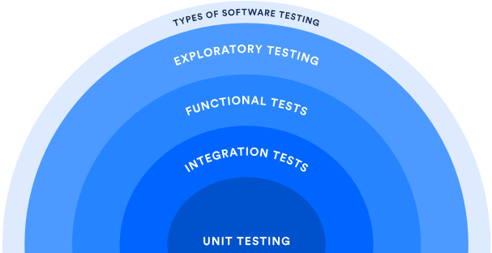

# Testing Patterns and Code Quality

## High-Level Concepts

- Black box testing: Test output of a given input
- White box testing: Examine program structure and business logic
  - **Statement/Line Coverage:** Examines all the programming statements.
  - **Branch Coverage:** Series of running tests to ensure if all the branches are tested.
  - **Path:** Path coverage refers to designing test cases such that all linearly  independent paths in the program are executed at least once. A linearly  independent path can be defined in terms of what’s called a control flow graph of an application.
    - Different levels over coverages: Node, link and loop coverage (when looking at the execution graph of the program)
- Regression testing: Verify that the system still works as intended
- Functional testing: Test things related to functionality
- Exploratory testing:
  - E.g. input fuzzying

## Levels of Testing

- Unit testing
  - Focuses on very small functional units.
  - The simplest way to check smallest units for isolation.
  - Generally performed by developers.
- Integration testing
- Functional / end-to-end testing
  - Used to check the functionalities of a software system i.e. output to the given input.
  - Difference to integration test: Would only check return, not that connection to db was established
- System testing
  - Testing all the integrated modules as a collective system.
  - Combines multiple features into end-to-end scenarios.
- Performance testing
  - Performance tests check the behaviors of the system when it is under significant load. 
- Smoke testing
  - Smoke tests are basic tests that check basic functionality of the  application. They are meant to be quick to execute, and their goal is to give you the assurance that the major features of your system are  working as expected.
- Acceptance testing
  - Acceptance tests are formal tests executed to verify if a system satisfies its business requirements. (i.e. client interaction works as expected) 

## Code Quality Tools

- Static (compile-time) asserts
- Runtime asserts
- Static code analysis
  - Code sanitizers: Spots potential issues
  - Code formatters
- Dynamic code analysis
  - zombies/memory leaks
  - invalid memory access / undef behaviour
- Code reviews
- Unit tests

## Testing Patterns

### Transactions

- Fundamental concept of all database systems
- Bundles multiple steps into a single, all-or-nothing operation

**Properties**

- **Atomic:** succeeded, or failed

- **Isolation:** ensures that transactions operated independently of of others; they are not visible till completed

  

### Fixtures

**Test Flow**

1. Begin transaction
2. Factories
3. Execute Logic
4. Assertions
5. Rollback transaction

### Mocking

TBD

### Fuzzying

