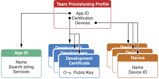

# Code Signing

> Code signing certifies that code is written by you. Confirms that the code cannot be modified after you have signed.
>
> Unlike on Android, apps cannot directly run on any device. Apps need to be signed by Apple first. 

### Provisioning Profiles

> Ties developers and devices to an authorized iPhone Development team and enables a device to be used for testing. 

- **contains**:
  - Development certificates: For devs who want to test the app on a physical device. Only the individuals whose iPhone Development Certificates are included in the profile can run the app.
  - Unique device identifiers: List of devices that the app can run on
  - an app ID: can include a `*` wild card
- types of profiles
  - Development
  - Ad Hoc
  - Enterprise
  - Distribution

## The process installing an app on your phone

1. The developer certificate mentioned in your provisioning profile is checked against the certificates saved in your Mac's keychain
2. This certificate is used to sign the code
3. The device on which you are running, it's UUID is checked against the IDs mentioned in the provisioning profile
4. Bundle Identifier of the app is checked against the app ID in the provisioning profile
5. Entitlements required by your app are verified with the associated ones with your App ID

## Utilities

- `security find-identity` list certificates

