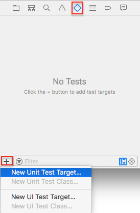

# Unit Testing in Swift


## Example

Add a new test


Start a test


## Asserts

```swift
XCTAssertEqual(my_integer, 95, "The computed score is wrong")
XCTAssertEqual(statusCode, 200)
XCTAssertNil(responseError)


```