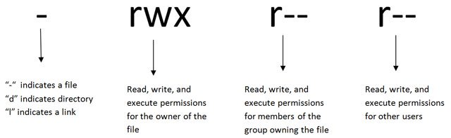

# File Permissions

This example:

- file permissions
- Owner: read, write, execute
- Group: read
- Others: read

**Displaying Permissions**

- `ls -l`

**Changing Permissions**

- `chmod +rwx filename` to add permissions.
- `chmod -rwx directoryname` to remove permissions.
- `chmod +x filename`to allow executable permissions.
- `chmod -wx filename` to take out write and executable permissions.

### Permission Numbers

