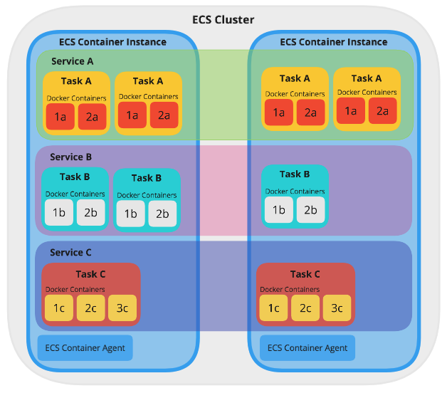

# Elastic Container Service (ECS)


#### Terminology

https://medium.com/@anilkumarmaurya/deploying-service-based-architecture-on-amazons-ecs-elastic-container-service-b0df14a00b3c


**Amazon EC2**: Amazon Elastic Compute Cloud, scalable compute power

**Container Instance:** EC2 instance that has Docker and ECS Container Agent running. Can run many Tasks from same or different Service

**Cluster**: Group of ECS Container Instances

**Task**: What you want to run. Instance of a Task Definition, running the containers detailed within it. One Task Definition can create several identical Tasks (e.g. as demand requires).

**Service**: How you want to run a task. Defines the minimum and maximum Tasks from one Task Definition run at any given time, autoscaling, and load balancing. A service launches and maintains copies of the task definition in your  cluster. For example, by running an application as a service, Amazon ECS will auto-recover any stopped tasks and maintain the number of copies  you specify.

**VPC:** A virtual private cloud (VPC) is a logical isolation of the resources. It’s necessary for ALB to work. I’m following this [example](https://docs.aws.amazon.com/codebuild/latest/userguide/cloudformation-vpc-template.html) that creates a pair of private subnets (where our containers will  live), a pair of public subnets (different AZs) and all the wiring -  routing tables and default routes, internet and NAT gateways.

**ECR**: Amazon Elastic Container Registry (ECR) is a fully-managed [Docker](https://aws.amazon.com/docker/) container registry that makes it easy for developers to store, manage,  and deploy Docker container images. Amazon ECR hosts your images in a  highly available and scalable architecture, allowing you to reliably  deploy containers for your applications.


**Example:** ECS Cluster

- Tasks defined in a service are distributed onto multiple ECS Container Instances
- Scaling is only done on a Task level, Containers per Task are fixed




## Service Regions


## Launch Types


Fargate:

AWS Fargate is a compute engine for Amazon ECS that allows you to run [containers](http://aws.amazon.com/what-are-containers) without having to manage servers or clusters. With AWS Fargate, you no  longer have to provision, configure, and scale clusters of virtual  machines to run containers. All you have to do is package your  application in containers, specify the CPU and memory requirements,  define networking and IAM policies, and launch the application

EC2:

EC2 launch type allows you to have server-level, more granular control over the infrastructure that runs your container applications. Amazon ECS  keeps track of all the CPU, memory and other resources in your cluster,  and also finds the best server for a container to run on based on your  specified resource requirements. You are responsible for provisioning,  patching, and scaling clusters of servers. You can decide which type of  server to use, which applications and how many containers to run in a  cluster to optimize utilization.


## Steps To Production


1. Configure the AWS CLI
2. Create a Docker image registry (Elastic Container Registry, ECR), login with Docker cli
3. Create an ECS Cluster
4. Create Task definitions
5. Configure load balacing
6. Configure ECS services
7. Add container instances to cluster
8. Launch Tasks on the cluster


## ECS Task Definition


#### Communication between Tasks


- create service
- enable service discover
  - port mpping


#### Communication inside Task


```json
 {
  "containerDefinitions": [
     {
       "name": "nginx",
       "image": "<NGINX reverse proxy image URL here>",
       "memory": "256",
       "cpu": "256",
       "essential": true,
       "portMappings": [
         {
           "containerPort": "80",
           "protocol": "tcp"
         }
       ],
       "links": [
         "app"
       ]
     },
     {
       "name": "app",
       "image": "<app image URL here>",
       "memory": "256",
       "cpu": "256",
       "essential": true
     }
   ],
   "networkMode": "bridge",
   "family": "application-stack"
}
```


## ECS Services


1. Open the Amazon ECS console
2. Navigate to a cluster
3. Select "Services" > "Create"
4. Configure
   - Service name
   - Service type [Replica, Daemon]
   - The number of tasks to run
   - Load balancing


## ECS Cluster Configuration

1. Go to the AWS Management Console and select the **ECS Service**
2. Select "Clusters" > "Create Cluster"
3. Select the "EC2 Linux + Networking" cluster template
4. Instance Configuration
   - Choose the EC2 instance type and the provisioning model
5. Networking
   - Create a new Virtual Private Cloud (VPC)
6. Container Instance IAM Role
   - The Amazon ECS container agents makes calls to the Amazon ECS API, need the role `ecsInstanceRole`

#### EC2 Type Instances

- see also [EC2 Instance Types](https://mindmajix.com/aws-ec2-instance-types)

- General Purpose **Instances** - (T2, M5, M4, M3)
- Computer Optimized **Instances** - (C5, C4, C3)
- Memory Optimized **Instances** - (X1, R4, R3)
- Accelerated Computing **Instances** - (P3, P2, G3, F1)
- Storage Optimized **Instances** - (I3)
- Dense Storage **Instances** - (D2)

**Cheapest Instances**

- t2.nano         $0.0016 / hour
  - Burst computing
- a1.medium  $0.0049 / hour
  - general purpose usage

#### Amazon Virtual Private Cloud (VPC)

- Enables you to launch AWS resources into a virtual network
- No additional charge for using Amazon VPC

#### Changing Cluster Settings

- Container instances launched in a cluster can be configured through the **AWS CloudFormation stack**
- Configure VPC, EC2 instance types etc through the CloudFormation console
- https://aws.amazon.com/de/premiumsupport/knowledge-center/ecs-change-container-instance-type/


#### Pausing ECS Instances


## ALB Load Balacing

https://www.bogotobogo.com/DevOps/Docker/Docker-Flask-ALB-ECS.php

https://docs.aws.amazon.com/AmazonECS/latest/developerguide/create-application-load-balancer.html


## Logging in Tasks


**Enable Logging for Containers**

- Edit task
- Edit container
- "Storage and logging" > enable "Auto-configure CloudWatch Logs"

**Viewing Container Logs**

- Select Cluster
- Select Service
- Navigate to "Logs" Tab
- or open [CloudWatch Console](https://us-east-2.console.aws.amazon.com/cloudwatch/home?region=us-east-2)