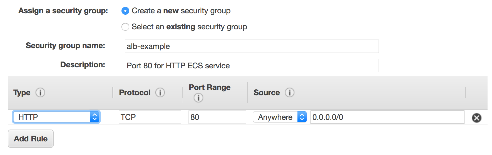

# Elastic Load Balancing (ELB)

The Load Balancer should be your gateway to the cluster. When running a  web service, make sure you've running your cluster in a private subnet  and your containers cannot be accessed directly from the internet.  Ideally, your internal container should expose a random, ephemeral port  which is bound to a target group. Make sure also that traffic is only  allowed from the Load Balancer's Security Group.

See also: https://medium.com/@sahityamaruvada/setting-up-aws-network-load-balancer-with-terraform-0-12-b87e75992949

**ELB (Elastic Load Balancer)**

- can be in public or private subnets
- can be in multiple subnets (e.g. across availability zones)
- **public**: connect service to internet
- **private**: routing e.g. between web and app tier (note that you get charged for an ELB)

The Application Load Balancer (ALB) is the  single point of contact for clients (users). Its function is to relay  the request to the right running task (think of a task as an instance  for now).

> In our case all requests on port 80 are forwarded to nginx task.

To configure a load balancer we need to specify a *listener* and a *target group*. The listener is described through rules, where you can specify  different targets to route to based on port or URL. The target group is  the set of resources that would receive the routed requests from the  ALB.

This target group will be managed by Fargate and every time a new instance of nginx spins up then it will register it automatically  on this group, so we don’t have to worry about adding instances to the  target group at all.

### External Traffic Routing

[TODO:  image]

### Internal Routing

- e.g. as alternative to service discovery

[TODO: Image]

#### Example: Creating a Load Balancer

- Navigate to "Load Balancers" and create a new one

- Select scheme "internet-facing" (will expose your application to the internet)

- Select the VPC of your cluster

- Select subnets from your availability zone

- Select a security group

  - select default ECS security group (all sources to port 80)
  - or create a new one

- Select the created target group (the service you want to expose to the internet)

  - Note: You have to assign your ECS instances to this target group so that they receive the traffic

- Verify that your service is accessible:

  - Select "Load Balancers" from the "Load Balacing" Tab

  - Open the DNS name (A Record) in the "Description" Tab of your load balancer, e.g.:

    `celery-flask-8413341.us-east-2.elb.amazonaws.com`

## Application vs Network Load Balancers

*Picking which load balancer is right for you will depend  on the specific needs of your application, such as whether or not  network traffic is HTTP, whether you need end to end SSL/TLS encryption, and whether or not you want host and path based traffic routing.*

**Network Load Balancer** — This is the distribution of traffic based on network variables, such as IP address and destination ports. It is layer 4 (TCP) and below and is  not designed to take into consideration anything at the application  layer such as content type, cookie data, custom headers, user location,  or the application behavior. It is *context-less*, caring only about the network-layer information contained within the packets it is directing this way and that.

This is a TCP Load Balancer only that does some NAT magic at the VPC level.  It uses EIPs, so it has a static endpoint unlike ALB and CLBs (by  default, contact support if this is a requirement for your CLB or ALB).  Each Target can be on different ports.

**Application Load Balancer** — This is the distribution of requests based on multiple variables, from the network layer to the application layer. It is *context-aware* and can direct requests based on any single variable as easily as it can a  combination of variables. Applications are load balanced based on their  peculiar behavior and not solely on server (operating system or  virtualization layer) information.

This is feature fulled L7 load balancer, HTTP and HTTPS listeners only.  Provides the ability to route HTTP and HTTPS traffic based upon rules,  host based or path based. Like an NLB, each Target can be on different  ports. Even supports HTTP/2. Configurable range of health check status  codes (CLB only supports 200 OK for HTTP health checks).

## Backlog

#### Load Balancer Definition

**General**

- select scheme: an internet-facing load balancer routes requests from clients over the internet to targets

- Listener: Select HTTP protocol and Load Balancer Port 80

  > A listener is a process that checks for connection requests, using the protocol and                  port that you configure. The rules that you define for a listener determine how the load balancer routes requests to its registered targets.

- select a port the load balancer should listen to

- select the VPC in which your containers live

- select a subnet (load balancer subnet must include availability zone of container instances)

**Security Group - Internet > ALB Listeners**

> A security group is a set of firewall rules that control the traffic for your task
>
> **NOTE:** Later in this topic, you create a security group rule for your container instances that allows traffic on all ports coming from the security group created here, so that the Application Load Balancer can route traffic to dynamically assigned host ports on your container instances.

- You must assign a security group to your load balancer that allows inbound traffic to the ports that you specified for your **listeners**. By default: 80

**Target Groups/Routing**

> Your load balancer routes requests to the targets in a target group using the target group settings that you specify, and performs health checks on the targets using the health check settings that you specify.

- Target type: `IP` or `Instance` (a specific EC2 instance)

  > If your service's task definition uses the `awsvpc` network mode (which is required for the Fargate launch type), you must choose `ip` as the target type, not  `instance`. This is because tasks that use the `awsvpc` network mode are associated with an elastic network interface, not an Amazon EC2 instance.

- Port: 80, the port the traffic is routed to
- VPC: the VPC your containers live in

**Registered Targets**

> Load balancer distributes traffic between the targets registered to its target groups.
>
> When associating a target group to an Amazon ECS service, ECS automatically registers/deregisters containers with your target group.

- skip

**Security Group - ALB > Containers**

> Allows inbound traffic from load balancer to container instances

- Type: All traffic
- Source: Custom > select name of the Application Load Balancer Security group, created to forward traffic on port 80 to the ALB listeners

