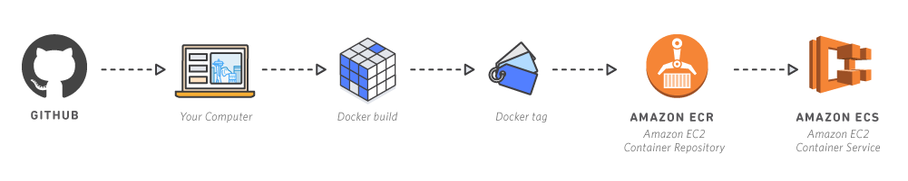

# Independently Scalable Microservices

Source: 

https://aws.amazon.com/de/getting-started/projects/break-monolith-app-microservices-ecs-docker-ec2




1. Dockerize application
2. Build Docker images
3. Tag the Docker images with according to the AWS ECR naming convention
4. Push to AWS ECR
5. Deploy in a service an ECS


### 1. Build the Docker Images

- Keep in mind: Some AWS instances run on ARM, you might have to cross-compile your images (see cross-compilation documentation for Docker)


### 2. Tag and Push to ECR

- see the Elastic Container Registry documentation


### 3. Deploy to ECS


## Misc Topics


### Inter-Container Communication

**Inside same container**

Containers that are collocated on a single container instance may be able to communicate with each other without requiring links or host  port mappings. Network isolation is achieved on the container instance  using security groups and VPC settings.

##### Inside same task

In network mode, you have to define two containers in the same task  definition and then mentioned the name of the container in the link.

**Different tasks**

Through service discovery:

- A task from one Amazon ECS service can connect with any other task in another Amazon ECS service.
- Tasks can connect to each other directly (without going through load balancers).
- Task IP addresses (and optionally, ports) in the Amazon ECS service are updated whenever tasks are started or stopped.


### Service Discovery

- enable service discovery during creation of the ECS services
- during task creation:
  - use bridge/host network mode for `SRV` records
  - use awsvpc network mode for `A` record


To allow your tasks to communicate with each other, complete the following steps:

1. [Create a new service](https://docs.aws.amazon.com/AmazonECS/latest/developerguide/create-service-discovery.html) using service discovery.
2. [Confirm that tasks are running](https://docs.aws.amazon.com/AmazonECS/latest/developerguide/ecs_run_task.html) in the Amazon ECS service.
3. [Associate a private hosted zone](https://docs.aws.amazon.com/Route53/latest/DeveloperGuide/hosted-zone-private-associate-vpcs.html) with the correct Amazon Virtual Private Cloud (Amazon VPC).
4. [Enable DNS resolution](https://docs.aws.amazon.com/vpc/latest/userguide/VPC_DHCP_Options.html#AmazonDNS) for the Amazon VPC with AmazonProvidedDNS.


### Managing/Inspecting Clusters

https://medium.com/faun/deploy-application-on-ecs-in-minutes-8bfb109bd9bb


- Navigate to "CloudFormation" in the AWS console
- Select your stack
  - 

**VPC**

- Navigate to "Load Balancer" serction of the ECS console

**Internet Gateway**

- virtual router that connects a VPC to the internet


### Exposing a Task to the Public

The Application Load Balancer (ALB) lets your service accept incoming traffic

**During Task Definition:**

- In the "Elastic load balancing" section, specify the container name and the port to expose

  `simple-app:80`

- Select `HTTP` as ELB listener protocol

- Select `80` as ELB listener port

**Defining Target group for ALB**

- Go to EC2 console
- Go to "Target Groups" under "Load Balancing"
- Select the VPC of your cluster
- After creating the target group: Make the EC2 instances of your cluster were added as targets
  - Select "Target Groups" from the "Load Balancing" Tab
  - Select the "Targets" tab
  - Check the "Registered targets" and verify that your instances have been added
  - If not, add them by clicking "Edit"

**Creating the ALB**

- Navigate to "Load Balancers" and create a new one

- Select scheme "internet-facing" (will expose your application to the internet)

- Select the VPC of your cluster

- Select subnets from your availability zone

- Select a security group

  - select default ECS security group (all sources to port 80)
  - or create a new one

- Select the created target group (the service you want to expose to the internet)

- Verify that your service is accessible:

  -  Select "Load Balancers" from the "Load Balacing" Tab

  - Open the DNS name (A Record) in the "Description" Tab of your load balancer, e.g.:

    `celery-flask-8413341.us-east-2.elb.amazonaws.com`

**Trouble Shooting**

- See [the docs](https://docs.aws.amazon.com/elasticloadbalancing/latest/application//load-balancer-troubleshooting.html) for a list of error codes and how to resolve them


### Updating a Service

If tag `latest` is specified:

- Update service and select "Force new deployment" (no need to update the task definition)


### Nginx and ECS Service discovery

- use variable to force Nginx to resolve address at runtime
- otherwise Nginx would not route to new containers

```
set $backend "api.local";
proxy_pass http://$backend:5000;
```

- nginx container network mode to "host" (?)


### Amazon Virtual Private Cloud(Amazon VPC)

Bei der ersten Ausführung der Amazon ECS-Konsole wird eine VPC für Ihren Cluster erstellt.                        Wenn Sie also vorhaben, die Amazon ECS-Konsole zu verwenden, können Sie direkt zum                        nächsten Abschnitt übergehen.                     


**Deriving VPC of your cluster**

- Navigate to the ["CloudFormation" console](https://us-east-2.console.aws.amazon.com/cloudformation)
- Select your cluster
- Select "Resources"
- The VPC allocated with this cluster is denoted under the "Vpc" id


### AWS Resource Management using the CLI

Launching a cluster

```bash
aws cloudformation deploy \
   --template-file infrastructure/ecs.yml \
   --region <region> \
   --stack-name Nodejs-Microservices \
   --capabilities CAPABILITY_NAMED_IAM
```

Task definitions from json

```json
{
    "containerDefinitions": [
        {
            "name": "[service-name]",
            "image": "[account-id].dkr.ecr.us-west-2.amazonaws.com/[service-name]:[tag]",
            "memoryReservation": "256",
            "cpu": "256",
            "essential": true,
            "portMappings": [
                {
                    "hostPort": "0",
                    "containerPort": "3000",
                    "protocol": "tcp"
                }
            ]
        }
    ],
    "volumes": [],
    "networkMode": "bridge",
    "placementConstraints": [],
    "family": "[service-name]"
}
```


-------------------


## Terminology

https://hackernoon.com/microservices-on-fargate-part2-f29c6d4d708f

A VPC is simply a logically isolated chunk of the AWS Cloud.

Our VPC has two public subnetworks since it’s a requirement for an  Application Load Balancer. The nginx container will use them too.

Then we will isolate backend and frontend to a private subnet so they can’t be reached directly from the Internet.


#### Internet Gateway

Allows communication between the containers  and the internet. All the outbound traffic goes through it. In AWS it  must get attached to a VPC.

All requests from a instances running  on the public subnet must be routed to the internet gateway. This is  done by defining routes laid down on route tables.


#### Network Address Translation (NAT) Gateway

When an application  is running on a private subnet it cannot talk to the outside world. The  NAT Gateway remaps the IP address of the packets sent from the private  instance assigning them a public IP so when the service the instance  wants to talk you replies, the NAT can receive the information (since  the NAT itself is public-facing and reachable from the Internet) and  hand it back to the private instance.

An Elastic IP needs to be associated with each NAT Gateway we create.

The reason why we traffic private tasks’ traffic through a NAT is so tasks  can pull the images from Docker Hub whilst keeping protection since  connections cannot be initiated from the Internet, just outbound traffic will be allowed through the NAT.

#### Routes and Route Tables

Route tables gather together a set of routes. A route describes where do  packets need to go based on rules. You can for instance send any packets with destination address starting with 10.0.4.x to a NAT while others  with destination address 10.0.5.x to another NAT or internet gateway (I  cannot find a proper example, I apologise). You can describe both in and outbound routes.

The way we associate a route table with a subnet is by using *Subnet Route Table Association* resources, pretty descriptive.


### Security

Security groups act as firewalls between inbound and outbound communications of the instances we run.

We need to create a security group shared by all containers running on  Fargate and another one for allowing traffic between the load balancer  and the containers.

The stack has one security group with two ingress (inbound traffic) rules:

1. To allow traffic coming from the Application Load Balancer *(PublicLoadBalancerSecurityGroup)*
2. To allow traffic between running containers *(FargateContainerSecurityGroup)*


### Load Balancer

The Application Load Balancer (ALB) is the  single point of contact for clients (users). Its function is to relay  the request to the right running task (think of a task as an instance  for now).

> In our case all requests on port 80 are forwarded to nginx task.

To configure a load balancer we need to specify a *listener* and a *target group*. The listener is described through rules, where you can specify  different targets to route to based on port or URL. The target group is  the set of resources that would receive the routed requests from the  ALB.

This target group will be managed by Fargate and every time a new instance of nginx spins up then it will register it automatically  on this group, so we don’t have to worry about adding instances to the  target group at all.

#### Service Discovery

In our application, we want the backend to be reachable at *ecsfs-backend.local*, the frontend at *ecsfs-frontend.local*, etc… You can see the names are suffixed with *.local.* In AWS we can create a ***PrivateDnsService\*** resource and add services to them, and that would produce the aforementioned names, that is, `.`.

By creating various DNS names under the same namespace, services that get  assigned those names can talk between them, i.e. the frontend talking to a backend, or nginx to the frontend.

The *IP* addresses  for each service task are dynamic, they change, and sometimes more than  task might be running for the same service… so… how do we associate the  DNS name with the right task? 🤔 Well we don’t! Fargate does it all for  us.