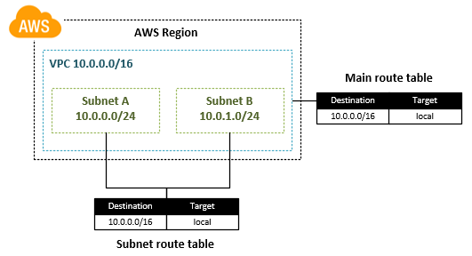

# AWS Networking Basics

#### Networking Components

- **VPC:** **V**irtual **P**rivate **C**loud, virtual isolated network, dedicated to your AWS account
  - On creation: Specify range of IPv4 addresses using a "Classless Inter-Domain Routing" (CIDR) block, e.g. `10.0.0.0/16`
  - Spans all availability zones in the region
- **Subnets:** Allow service separation and higher security
  - On creation: Specify IP range using a CIDR block that is a subset of the VPC CIDR block.
  - Subnets cannot span multiple availability zones
  - launch instances in separate availability zone to protect from failure of a single location
  - public/private subnets: Subnet is **public** if traffic is routed to an **Internet gateway**
- **Availability Zone**: AWS regions support local zones, the availability zones. 
  - Availability Zones are distinct locations that are engineered to be isolated from failures in other Availability Zones
- **Route Tables:** Contains a set of routes that define where packets will be redirected to
- **Internet Gateway:** Allows communication between 
- **NAT Gateway:** Allow instances in the private subnet to make outbound connections to the internet
- **AWS Private Link:** Allows connections to AWS services (e.g. for fetching docker images from ECR). Alternative to linking the private subnet to a NAT Gateway.
- **Gateway Endpoints**:
  - https://docs.aws.amazon.com/vpc/latest/userguide/vpc-endpoints-s3.html

## VPCs and Subnets

> A VPC is a logically isolated virtual network dedicated to your AWS account.
>

- All availability zones inside the selected AWS region
- Range of IPv4 addresses must be specified through a CIDR block, e.g. `10.0.0.0/16`
  - **NOTE:** Private address ranges should be used, see section "Network Classes". Publicly routable addresses can cause issues.
- When you associate a CIDR block with your VPC, a route (the main route table) is automatically added to your VPC route tables to enable routing within the VPC (the destination is the CIDR block and the target is `local`). See also section *Route Tables*.

### Subnets

- When you create a subnet, you specify the CIDR block for the subnet, **which is a subset of the VPC CIDR block**. 
- Each subnet must reside entirely within one Availability Zone and cannot span zones. 

**Public vs Private Subnets**

- If a subnet's traffic **is routed** to an internet gateway, the subnet is known as a **public subnet**
- If a subnet **doesn't** have a route to the internet gateway, the subnet is known as a **private subnet**

**Subnet Security**

AWS provides two features that you can use to increase security in your VPC: *security groups* and                                    			*network ACLs*. Security groups control inbound and outbound traffic for your                                    			instances, and network ACLs control inbound and outbound traffic for your subnets.                                    			In most cases, security groups can meet your needs; however, you can also use network                                    ACLs if you want an additional layer of security for your VPC. For more information,                                    see                                     			[Internetwork Traffic Privacy in Amazon VPC](https://docs.aws.amazon.com/vpc/latest/userguide/VPC_Security.html).                                  

By design, each subnet must be associated with a network ACL. Every                                    subnet that you create is automatically associated with the VPC's default                                    network ACL. You can change the association, and you can change the                                    contents of the default network ACL. For more information, see [Network ACLs](https://docs.aws.amazon.com/vpc/latest/userguide/vpc-network-acls.html).                                 

### Examples

**Creating a private subnet**

1. Open the [AWS VPC Console](https://console.aws.amazon.com/vpc/)
2. In the left navigation pane, choose **Subnets**.                         
3. Choose **Create Subnet**.
4. For **Name tag**, enter a name for your subnet, such as  **Private subnet**.                         
5. For **VPC**, choose the VPC that you created earlier.                         
6. For **Availability Zone**, choose a different Availability Zone than your original subnets in the VPC.                         
7. For **IPv4 CIDR block**, enter a valid CIDR block. For  example, the wizard creates CIDR blocks in 10.0.0.0/24 and 10.0.1.0/24 by default. You could use **10.0.3.0/24** for your second private                            subnet.
8. Choose **Yes, Create**.

---------

**Creating a public subnet**

1. In the left navigation pane, choose **Subnets** and then  **Create Subnet**.                         
2. For **Name tag**, enter a name for your subnet, such as **Public subnet**.                         
3. For **VPC**, choose the VPC that you created earlier.                         
4. For **Availability Zone**, choose the same Availability Zone as the additional private subnet that you created in the previous procedure.                         
5. For **IPv4 CIDR block**, enter a valid CIDR block. For example, the wizard creates CIDR blocks in 10.0.0.0/24 and 10.0.1.0/24 by default. You could use **10.0.2.0/24** for your second public                            subnet (/24 allows for 256 ip addresses in the subnet).
6. Choose **Yes, Create**.                         
7. Select the public subnet that you just created and choose **Route Table**, **Edit**.                         
8. By default, the private route table is selected. Choose the other available route table so that the **0.0.0.0/0** destination is routed to the internet gateway (**igw-xxxxxxxx**) and choose **Save**.                         
9. With your second public subnet still selected, choose **Subnet Actions**, **Modify auto-assign IP                               settings**.
10. Select **Enable auto-assign public IPv4 address** and choose **Save**, **Close**.                         

---------

**Deriving VPC of your cluster**

- Navigate to the ["CloudFormation" console](https://us-east-2.console.aws.amazon.com/cloudformation)
- Select your cluster
- Select "Resources"
- The VPC allocated with this cluster is denoted under the "VPC" id

## Route Tables

> Route tables gather together a set of routes. A route describes where do packets need to go based on rules. You can for instance send any packets with destination address starting with 10.0.4.x to a NAT while others with destination address 10.0.5.x to another NAT or internet gateway. You can describe both in and outbound routes.

- Each route in the table defines a **destination** and a **target**
- The most specific route that matches the traffic (longest prefix match) determines how to route

- **Destinations**
  - CIDR block for the that specifies a range of destination addresses of requests
  - `0.0.0.0/0` (`::/0` for IPV6)represents all IPv4 addresses. In the context of the way routing tables get set up by default on AWS, **0.0.0.0/0 is** effectively "all non local addresses". This is because another route presumably exists in the routing table to route the VPC subnet to the local network on the VPC (with target `local`).
- **Targets**
  - `local` address space of the VPC. Routing to `local` allows resources to talk to others inside the VPC

Example: Routing traffic to an internet gateway

| Destination | Target                |
| ----------- | --------------------- |
| 0.0.0.0/0   | igw-12345678901234567 |

- What does 0.0 0.0 0 mean in a routing table?

  **0.0.0.0/0** represents all possible IP addresses. 

**VPC Routing**

- When you associate a CIDR block with your VPC, a route (the main route table) is automatically added to your VPC route tables to enable routing within the VPC (the destination is the CIDR block and the target is `local`)
- Main route
-  table allows communication inside the VPC

**Route Tables**

- router of VPC uses route tables to control where network traffic is directed
- Each subnet in the VPC must be associated with route table
  - If no explicite table is associated, the main route table is selected

**Main Route Table**

- Controls routing for subnets that are not explicitly associated with any other route table
- By default: Contains 

**Routes**

- Each route in the table defines a **destination** and a **target**
- 
- 

| Destination | Target                |
| ----------- | --------------------- |
| 0.0.0.0/0   | igw-12345678901234567 |

If your route table has multiple routes, we use the most specific route that                                    matches the traffic (longest prefix match) to determine how to route the                                    traffic.                                 

### Examples

**Example:** Main VPC route table

| Destination   | Target | Purpose                                                      |
| ------------- | ------ | ------------------------------------------------------------ |
| `10.0.0.0/16` | local  | Default entry for local routing. Enables instances in the VPC to communicate with each other. |

**Example:** Route Tables of subnets

- Each subnet must be associated with a route table, which specifies the allowed routes for outbound traffic leaving the subnet

| Destination   | Target | Purpose                                                      |
| ------------- | ------ | ------------------------------------------------------------ |
| `10.0.0.0/16` | local  | Default entry for local routing. Enables instances in the VPC to communicate with each other. |

**Routing through Internet Gateway**

**Routing**

Main Route Table

| Destination   | Target             | Purpose                                                      |
| ------------- | ------------------ | ------------------------------------------------------------ |
| `10.0.0.0/16` | local              | Default entry for local routing. Enables instances in the VPC to communicate with each other. |
| `0.0.0.0/0`   | <*nat-gateway-id*> | Sends all other subnet traffic to the NAT gateway.           |

Custom Route Table

| Destination   | Target     | Purpose                                                      |
| ------------- | ---------- | ------------------------------------------------------------ |
| `10.0.0.0/16` | local      | Default entry for local routing.                             |
| `0.0.0.0/0`   | <*igw-id*> | Routes all other subnet traffic to the Internet over the Internet gateway. |

## IPv4 Network Classes

> The IPv4 address space is partitioned into different classes. The Classless Inter-Domain Routing (CIDR) blocks define specific ranges of IPv4 addresses.

#### Network Classes

> Under classful network addressing, the 32-bit IPv4 address space was partitioned into 5 classes (A-E)

The IPv4 space is distributed into 3 blocks:

- **Class Bits**: Specifies the class (A-E)
  - Each class can hold a different number of networks and hosts
- **Network Bits**: Specify the network ID range
- **Host Bits**: Specify the available host ID range

| Class | Network length | No. Networks         | Host Length | No. Hosts             | CIDR |
| ----- | -------------- | -------------------- | ----------- | --------------------- | ---- |
| A     | 7 bit          | 126 (2^7 – 2)        | 24 bit      | 16,777,214 (2^24 – 2) | /8   |
| B     | 14 bit         | 16,382 (2^14 – 2)    | 16 bit      | 65,534 (2^16 – 2)     | /16  |
| C     | 24 bit         | 2,097,150 (2^21 – 2) | 8 bit       | 254 (2^8 – 2)         | /24  |
| D     |                |                      |             |                       |      |
| E     |                |                      |             |                       |      |

#### Dedicated / Reserved IP Ranges

**Diagnostic / Loopback Ranges**

- **Class A**: 127.0.0.0 to 127.255.255.255 cannot be used and is reserved for loopback and diagnostic functions.
  - **Example:** 127.0.0.1 is used for loopback to local machine

**Private IP Address Ranges**

> The Internet Assigned Numbers Authority (IANA) has reserved the following three blocks of the IP address space for private internets

- **Class A**: `10.0.0.0`           -   `10.255.255.255`    (10/8 prefix)    subnet mask 255.0.0.0

- **Class B**: `172.16.0.0`       -   `172.31.255.255`   (172.16/12 prefix)    255.240.0.0

- **Class C**: `192.168.0.0`     -   `192.168.255.255` (192.168/16 prefix)  255.255.0.0

**Dedicated Host IP Addresses**

- `*.*.*.0` Network address
  - First address of class
  - **Example, Class C**: 192.168.0.0
- `*.*.*.1` Router
  - Second address of class
  - **Example, Class C**: 192.168.0.1

**Reserved IP Adresses on AWS**

- `10.0.0.0`: Network address
- `10.0.0.1`: Reserved by AWS for the VPC router.
- `10.0.0.2`: Reserved by AWS. The IP address of the DNS server is the base of the VPC network range plus two. For VPCs with multiple CIDR blocks, the IP address of the DNS server is located in the primary CIDR. We also reserve the base of each subnet range plus two for all CIDR blocks in the VPC. 
- `10.0.0.3`: Reserved by AWS for future use.                                          
- `10.0.0.255`: Network broadcast address. We do not support                                             							broadcast in a VPC, therefore we reserve this address.                                           

#### CIDR Notation and Subnet Masks

> - Subnet masks are the numerical representation of binary masks for IPv4 addresses and allow to specify a specific IP range.
> - CIDR is a different notation where the number of set bits in the mask are summed to for a more compact representation

- CIDR suffix tells how many bits from beginning of the address belongs to the network
  - Examples IPv4:
    - `172.16.0.1/16`  - network bits: `172.16.`, possible hosts in this network: 2^16 = 65536
    - `172.16.0.1/24` - network bits: `172.16.0.`, possible hosts in this network: 2^8 = 256

**Subnet Masks**

> Same principle as CIDR blocks but expressed in decimal representation instead

- 255.255.255.0 ≙ 11111111 11111111 11111111 00000000 /24 (first 24 bits)

- Class A: 255.0.0.0
- Class B: 255.255.0.0

## Internet Gateway

Allows communication between the containers  and the Internet. All the outbound traffic goes through it. In AWS it must get attached to a VPC.

All requests from a instances running  on the public subnet must be routed to the Internet gateway. This is  done by defining routes laid down on route tables.

## Network Address Translation (NAT) Gateway

You can use a network address translation (NAT) instance in a **public** subnet in your VPC to enable instances in the **private** subnet to initiate outbound IPv4 traffic to the Internet or other AWS services (e.g. to pull Docker images), but prevent the instances from receiving inbound traffic initiated by someone on the Internet.

**NAT Gateway vs. NAT Instance**

- NAT Gateway: Managed by AWS, less configuration options
- NAT Instance: Managed by you, more configuration options (such as port forwarding) at the cost of higher maintenance
- See also [Instance vs Gateway](https://docs.aws.amazon.com/vpc/latest/userguide/vpc-nat-comparison.html)

#### Example: Creating a NAT Gateway

1. Head to the AWS VPC Console
2. "NAT Gateways > Create NAT Gateway"
3. Select public Subnet
4. Assign or create a new Elastic IP

## Network Security / Security Groups

- Security groups act as firewalls between inbound and outbound communications of the instances we run

- Security group rules are implicit deny, which means all traffic is denied unless an inbound or outbound rule explicitly allows it.

### Examples

**Chaining security groups**

- Inbound traffic can be limited to sources that have a specific security group assigned
- In this examples:
  - **The ALB** receives traffic from all IPs on port 80 and forwards it to Service 1
  - **Service 1** only allows traffic from the security group A and forwards it to Service 2
  - **Service 2** only allows traffic from security group B

**Limiting traffic to a subnet**

- Inbound traffic can be limited to a subnet by specifying the subnet's IP/CIDR as source

### Sample Configurations

**Allow connections between instances within the same security group**

| Protocol type | Protocol number | Ports    | Source IP                    |
| ------------- | --------------- | -------- | ---------------------------- |
| -1 (All)      | -1 (All)        | -1 (All) | The ID of the security group |

**Allow HTTP requests from within the VPC**

| Protocol type | Source      | Ports |
| ------------- | ----------- | ----- |
| tcp           | 10.0.0.0/16 | 80    |

**Allow connections from within a Subnet**

| Protocol type | Source   | Ports |
| ------------- | -------- | ----- |
| tcp           | 10.0.1.0 | 80    |

## AWS PrivateLink

- before PrivateLink, EC2 instances had to use an internet gateway to download docker images stored in ECR or to communicate with the ECS control plane. Instances in public subnet used the internet gateway directly. Instances in private subnet used a network address translation (NAT) gateway hosted in a public subnet.
- Now that AWS PrivateLink support has been added, instances in both  public and private subnets can use it to get private connectivity to  download images from Amazon ECR. Instances can also communicate with the ECS control plane via AWS PrivateLink endpoints without needing an  internet gateway or NAT gateway.

https://aws.amazon.com/de/blogs/compute/setting-up-aws-privatelink-for-amazon-ecs-and-amazon-ecr/

https://docs.aws.amazon.com/AmazonECR/latest/userguide/vpc-endpoints.html

## Elastic Load Balancing (ELB)

The Load Balancer should be your gateway to the cluster. When running a  web service, make sure you've running your cluster in a private subnet  and your containers cannot be accessed directly from the internet.  Ideally, your internal container should expose a random, ephemeral port  which is bound to a target group. Make sure also that traffic is only  allowed from the Load Balancer's Security Group.

**ELB (Elastic Load Balancer)**

- can be in public or private subnets
- can be in multiple subnets (e.g. across availability zones)
- **public**: connect service to internet
- **private**: routing e.g. between web and app tier (note that you get charged for an ELB)

The Application Load Balancer (ALB) is the  single point of contact for clients (users). Its function is to relay  the request to the right running task (think of a task as an instance  for now).

> In our case all requests on port 80 are forwarded to nginx task.

To configure a load balancer we need to specify a *listener* and a *target group*. The listener is described through rules, where you can specify  different targets to route to based on port or URL. The target group is  the set of resources that would receive the routed requests from the  ALB.

This target group will be managed by Fargate and every time a new instance of nginx spins up then it will register it automatically  on this group, so we don’t have to worry about adding instances to the  target group at all.

### External Traffic Routing

[TODO:  image]

### Internal Routing

- e.g. as alternative to service discovery

[TODO: Image]

#### Example: Creating a Load Balancer

- Navigate to "Load Balancers" and create a new one

- Select scheme "internet-facing" (will expose your application to the internet)

- Select the VPC of your cluster

- Select subnets from your availability zone

- Select a security group

  - select default ECS security group (all sources to port 80)
  - or create a new one

- Select the created target group (the service you want to expose to the internet)

  - Note: You have to assign your ECS instances to this target group so that they receive the traffic

- Verify that your service is accessible:

  - Select "Load Balancers" from the "Load Balacing" Tab

  - Open the DNS name (A Record) in the "Description" Tab of your load balancer, e.g.:

    `celery-flask-8413341.us-east-2.elb.amazonaws.com`

## Example: VPC with a Single Public Subnet

https://docs.aws.amazon.com/vpc/latest/userguide/VPC_Scenario1.html

## Example: VPC with Public and Private Subnets (NAT)

https://docs.aws.amazon.com/vpc/latest/userguide/VPC_Scenario2.html

**Subnet Setup Best practice**

- use public subnets for external resources and private subnets for internal resources
- different routing tables for private and public subnets
- public subnets share a single routing table; the only route they use is to the Internet-gateway to communicate with the Internet

https://docs.aws.amazon.com/vpc/latest/userguide/VPC_Scenario2.html

**Routing**

Main Route Table

| Destination   | Target             | Purpose                                                      |
| ------------- | ------------------ | ------------------------------------------------------------ |
| `10.0.0.0/16` | local              | Default entry for local routing. Enables instances in the VPC to communicate with each other. |
| `0.0.0.0/0`   | <*nat-gateway-id*> | Sends all other subnet traffic to the NAT gateway.           |

Custom Route Table

| Destination   | Target   | Purpose |
| ------------- | -------- | ------------- |
| `10.0.0.0/16` | local| Default entry for local routing. |
| `0.0.0.0/0`   | <*igw-id*> | Routes all other subnet traffic to the Internet over the Internet gateway. |

**Security**

