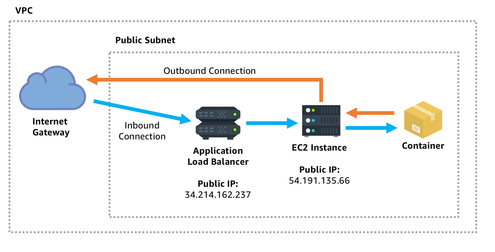
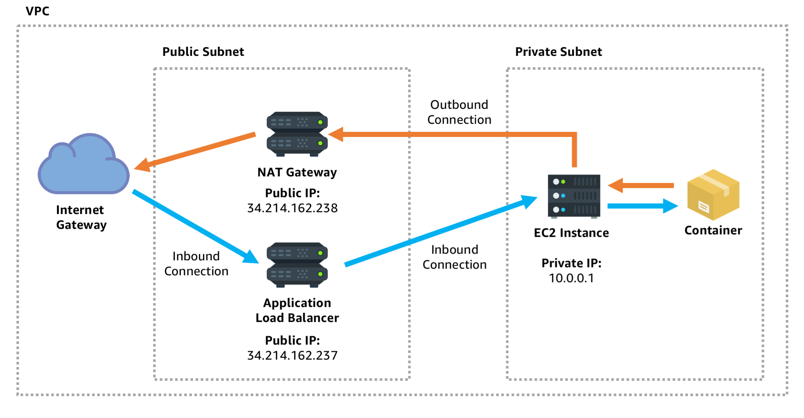
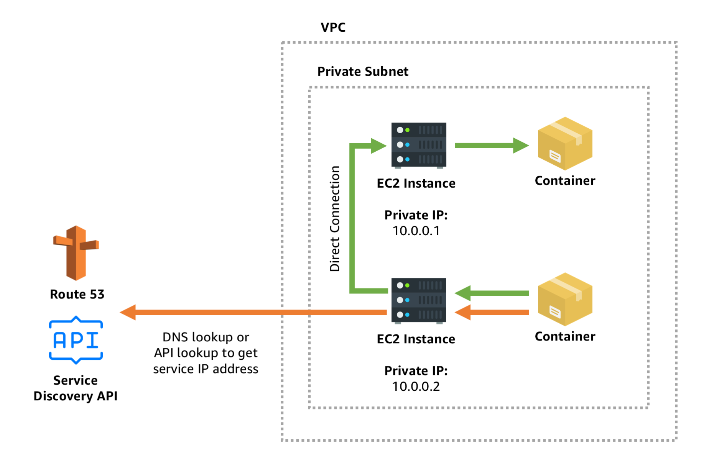

# Service Discovery

## Implementation

- Setting up ServiceDiscoverry on Fargate

  https://aws.amazon.com/de/blogs/aws/amazon-ecs-service-discovery/

- Deleting a Service from ServiceDiscovery

  https://stackoverflow.com/questions/53370256/aws-creation-failed-service-already-exists-service-awsservicediscovery-stat

- Service Discovery Configuration Options

  https://stackoverflow.com/questions/56897754/not-able-to-make-aws-ecs-services-communicate-over-service-discovery

## Architecture Patterns

https://containersonaws.com

#### Public Service, Public Network

- A public facing endpoint designed to receive push notifications
- An edge service which needs to make outbound connections to other services on the internet

#### Public Service, Private Network

- A service which is public facing but needs an extra layer of security  hardening by not even having a public IP address that an attacker could  send a request directly to.
- A service which initiates outbound connections but to the public you  want those connections to **originate from a specific and limited set of  IP addresses** that can be whitelisted

#### Private DNS Service Discovery

**Use Cases**

- Private, internal service discovery
- Low latency communication between services
- Long lived bidirectional connections, such as gRPC.

**Configuration**

- Single private Subnet
- Containers inside the subnet can communicate to each other using their  internal IP addresses. But they need some way to discover each other’s  IP address.

**Service Discovery**

- Option 1: DNS
- Option 2: REST api

## Example

