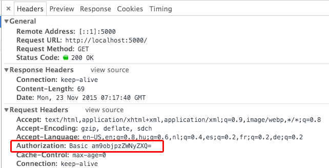

# Access Control and Authentication

### Method Overview

[TOC]

**Which method to choose?**

- Web application only: either cookies or tokens
- Web and mobile: token-based
- Communicating APIs: Request signing

## Stateless Authentication

### 1. *Basic* Access Authentication

**Process**
- string concatenation: `username:password`
- Encoded with Base64
- `Basic` is put before basic keyword
- Client sends the `Authorization` header along with every request it makes
  - e.g. `curl --header "Authorization: Basic am9objpzZWNyZXQ=" my-website.com`

**Header Signature**

**Advantages**

- Stateless: Doesn't require cookies, sessions or anything else

**Disadvantages**

- Login credentials sent with every request - potentially exposing them
- DB queries (authorization) needed for every request
- Uses easily **reversible** Base64 encoding for username/password instead of encrpytion
- **Unsafe** if not used with TLS (Transport Layer Security) or preprocessor SSL (Secure Socket Layer)
- No way to logout user
- Expiration of credentials is not trivial

### *2. Digest* Access Authentication
- Applies hash function to username and password before sending the over network

### 3. JWT: JSON Web Tokens

**Contains of 3 parts:**

- Header, with type of token and hashing algorithm
- Payload
- Signatur, which is calculated e.g. as:
  - `HMACSHA256( base64UrlEncode(header) + "." + base64UrlEncode(payload), secret)`

**Header Signature**
`Authorization: Bearer <token>`

**Authentication Process**

1. User provides credentials (POST request)
2. Server verifies credentials (query) and returns a signed token
3. Token is stored in client side
4. Subsequent requests to the server will be sent with the token as authentication header
5. Server verifies token and returns requested data
6. Token is destroyed in client on logout
  

**Advantages**

- JWTs are self containing: No need to query database multiple times

**Disadvantages**

## Stateful Authentication

### 1. Cookies

- Server responds with a `Set-Cookie` header
- Cookie is sent along every request made to the same origin of the Cookie

**Process**
- User enters credentials
- Server validates credentials and creates unique session id
- session id is temporarily stored on server and sent back in cookie to client
- Client stores cookie and returns it in subsequent requests
- Server validates session id in cookie to allow access
- When user logs out: Server removes cookie, client deletes cookie

**Key Principles**
- Use **signed** cookies

**Disadvantages**
- stateful: authentication records need to be stored both client and server side
- Extra efford to protect against CSRF attacks
- Incompatiblye with REST (stateless protocol)

### 2. Signatures

- If transport layer is exposed: credentials are easy to access
- **Solution**: Sign each request with a private key

**Process**
- consumer of API creates a hash of entire request using private key
- API dehashes the request using the same *known* private key

**Advantages**
- even if the transport layer gets compromised, an attacker can only read your traffic, won't be able to act as a user

**Disadvantages**
- cannot use in the browser/client, only between APIs (both the consumer of the API and the provider have to have the same private key)

### 3. One-Time Passwords
- one-time password generated with a shared secret and/either the current time or a counter
- Two-factor authentication

**Process**
- user enters credentials
- both server and client generate a one-tim password

**Disadvantages**
- with shared-secret (if stolen) user tokens can be emulated
- clients can be stolen/lost, application must have a method to bypass this (like reset email), which provides additional attack vectors

### 4. Public Key Authentication

### 5. Kerberos

## Nonce and Salts

### Salts

- Random data to help protect agains **precomputation attacks** (e.g. dict attack)
- Salt is concatenated to the front of password before hasing it and then comparing the output to the hashed values in the database
- Attackers would have to generate totally different dictionary of passwords for every salt

### Nonce

