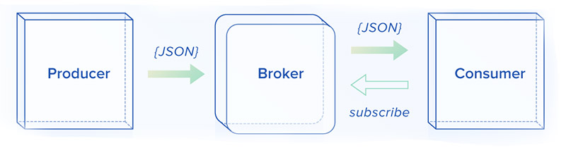

# Celery

> Asynchronous task queue/job queue based on distributed message passing




**example**: https://github.com/mattkohl/docker-flask-celery-redis


**How task scheduling works**

- Client sends new task to message broker
- message broker stores task in result backend
- worker fetches task over message broker
- saves task over message broker to result backend
- Client polls result backend for completed task

**Steps to integrate Celery**

1. Choose a Broker (e.g. Redis/Rabbit MQ)
2. Installing Cerery
3. Define tasks
4. Running the workers


## Basic Setup and Configuration

### Shared Codebase

```
proj/__init__.py
    /scheduler.py
```

**scheduler.py**

```python
# Connect to the Celery instance
MODULE_NAME = "tasks"
CELERY_RESULT_BACKEND = "redis://localhost:6379/0"
CELERY_BROKER_URL = "redis://localhost:6379/0"
celery = Celery(MODULE_NAME, 
                backend=CELERY_RESULT_BACKEND, 
                broker=CELERY_BROKER_URL)

@celery.task
def hello():
    return 'hello world'

# submit a task
signature("hello")
signature.delay()
```


### Separate Scheduler / Workers

````
project/
	/workers
		tasks.py
	/scheduler
		scheduler.py
````

**scheduler.py**

> Schedules the tasks - adds it the worker queue

```python
# Connect to the Celery instance
MODULE_NAME = "tasks"
CELERY_RESULT_BACKEND = "redis://localhost:6379/0"
CELERY_BROKER_URL = "redis://localhost:6379/0"
celery = Celery(MODULE_NAME, backend=CELERY_RESULT_BACKEND, broker=CELERY_BROKER_URL)

# submit a task
signature("do_something", args=("my task input",))
signature.delay()
```

**tasks.py**

> Celery worker that consumes tasks in the queue

```python
# Connect to the Celery instance
MODULE_NAME = "tasks"
CELERY_RESULT_BACKEND = "redis://localhost:6379/0"
CELERY_BROKER_URL = "redis://localhost:6379/0"
celery = Celery(MODULE_NAME, backend=CELERY_RESULT_BACKEND, broker=CELERY_BROKER_URL)

# Define the tasks
@celery.task(name="do_something")
def do_something(task_input):
    return task_input
```


## Configuration

Celery config:

https://docs.celeryproject.org/en/latest/getting-started/first-steps-with-celery.html

```python
app = Celery('proj',
             broker=CELERY_BROKER_URL,
             backend=CELERY_RESULT_BACKEND)
app.conf.update(
    result_expires=3600,
)
```


## Logging

```python
from celery.utils.log import get_task_logger

logger = get_task_logger(__name__)

@app.task
def add(x, y):
    logger.info('Adding {0} + {1}'.format(x, y))
    return x + y
```


--------------


## Task Definition

http://docs.celeryproject.org/en/master/userguide/canvas.html#the-primitives

### Basics

- `@task` decorator available on Celery instance

```python
from celery import Celery
MODULE_NAME = 'tasks'
BROKER_URL = 'redis://localhost:6379'
app = Celery(MODULE_NAME, broker=BROKER_URL)

@app.task
def add(x,y):
    return x + y
```

**Names**

```python
@app.task(name='sum-of-two-numbers')
def add(x, y):
    return x + y
```

**Importing Tasks**

- always use absolute imports
- or new-style relative imports

```python
from project.myapp.tasks import mytask
from .module import foo
```

**Bound tasks**

- access to `self`
- query state and access information about current request

```python
logger = get_task_logger(__name__)

@app.task(bind=True)
def add(self, x, y):
    logger.info(self.request.id)
```

**Task Inheritance**

- `base` arugment in definition

```python
class MyBase(celery.Task):
    def on_failure(self, exc, task_id, args, kwargs, einfo):
        print('{0!r} failed: {1!r}'.format(task_id, exc))
```

```python
@app.task(base=MyTask)
def add(x, y):
    raise KeyError()
```

**Variable Arguments**

```python
@app.task
def add(first_arg, *argv, **kwargs):
    logger.info(first_arg)
    for arg in argv:  
        logger.info(arg)
    for key, value in kwargs.items(): 
        print ("%s == %s" %(key, value)) 
```


### Signatures

- wraps arguments and execution option of a single task
- signatures of tasks can be passed into another process or to another function

**Defining a Signature**

Option 1:

```python
from celery import signature
signature('tasks.add', args=(2, 2))
```

Option 2:

```python
add.signature((2, 2))
```

Option 3: Shortcut

`add.s(2, 2)`

**Passing Arguments to Signatures**

- supports keyword arguments

`add.s(2, 2, debug=True)`

**Partial Signatures**

```python
partial = add.s(2)
partial.delay(4)  # 4 + 2
```

**Immutable Signatures**

- `immutable=True`
- disallow partial arguments

```python
add.signature((2, 2), immutable=True)
```


----------

### Calling Signatures


Execute in current process

`add.s(2, 2)()`

Execute in a worker:

```python
result = add.delay(2, 2)
result.get()
```

Specifying options:

```python

```


--------

### Primitives

#### Chains

- links signatures sequentially (chain of callbacks)

```python
from celery import chain
res = chain(add.s(2, 2), add.s(4), add.s(8))()
```

#### Groups

- list of tasks that should be executed in **parallel**

```python
from celery import group
res = group(add.s(i, i) for i in xrange(10))()
```

**Result Status**

- `successful()` all subtasks were successfully finished

- `failed()` if any subtasks failed
- `waiting()` if any subtask is not ready yet
- `ready()` if all subtasks are ready
- `completed_count()` Number of completed subtasks
- `join()` Gather all results and return in call order
- `revoke()` Abort tasks

#### Chord

- Group with additional callback that is executed after all tasks have finished
- synchronization is expensive; avoid chords if possible
- tasks within chords must **not** ignore their results
- see also `link` of `apply_async` (similar functionality but cannot be applied to groups)

```python
from celery import chord
callback = tsum.s()
header = [add.s(i, i) for i in range(100)]
task_signature = chord(header, callback)
result = task_signature.delay()
result.id # id of the callback
```

```python
# __call__ executes the header inline.
chord(header, body)()

# apply_async executes the header in a task
chord(header, body).apply_async()
# same as apply_async()
chord(header)(body)
```

Similar with `link`:

```python
add.apply_async((2, 2), link=mul.s(16))
```

#### Map

- Creates a temporary task where a list of arguments is applied to the task

` task.map([1, 2])` results in `res = [task(1), task(2)]`

#### Starmap

- Like map but arguments are applied as `*args`

`add.starmap([(2, 2), (4, 4)])`  results in `res = [add(2, 2), add(4, 4)]`

#### Chunks

- splits a long list of arguments into parts

**Example:**

- split arguments `[(0, 0), (1, 1), (2, 2) ,...]` into chunks **10**

- resulting in **100** tasks, each processing **10** items in sequence


```python
>>> items = zip(xrange(1000), xrange(1000))  # 1000 items
>>> add.chunks(items, 10)
```


#### Operators

https://docs.celeryproject.org/en/latest/userguide/canvas.html

**Chaining**

```python
# same as a chord
c3 = (group(add.s(i, i) for i in xrange(10)) | xsum.s())
res = c3()
res.get()
```

```python
# ((4 + 16) * 2 + 4) * 8
c2 = (add.s(4, 16) | mul.s(2) | (add.s(4) | mul.s(8)))
```

```python
# (16 + 4) * 8
c1 = (add.s(4) | mul.s(8))
```


------


## Task Execution

http://docs.celeryproject.org/en/master/userguide/calling.html#guide-calling

### Executing Tasks

> **NOTE:** this applies to tasks and signatures


**Execution in current Process**

*calling* (`__call__`) 

- **Example:** `task()`
- executes task in current process

**Asynchronous Execution**

> All asynchronous executers return a promise `celery.result.AsyncResult`, see also section "Result Querying"

- `T.apply_async(args, kwargs)`
  - **Example**: `task.apply_async(args=[arg1, arg2], kwargs={'kwarg1': 'x', 'kwarg2': 'y'})`
- `T.delay(*arg, **kwargs)`
  - **Example**: `task.delay(arg1, arg2, kwarg1='x', kwarg2='y')`
  - star argument version of `apply_async()`
  - doesn't support execution options (use `set()`)
- `send_task(name, args=None, ...)`
  - use if task isn't registered in the current process
  - supports same arguments as `T.apply_async`


### Callbacks/Errbacks

**Callbacks**

- `link=my_callback.s()`
- executed after task was successful
- arguments: return value of parent task

```python
add.apply_async((2, 2), link=add.s(8))
```

**Errbacks**

- `link_error=my_error_handler.s()`

```
@app.task
def error_handler(uuid):
    result = AsyncResult(uuid)
    exc = result.get(propagte=False)
    print("Task {} raised exception".format(uuid))
    print(result.traceback)
    
add.apply_async((2, 2), link_error=error_handler.s())
```


### Communicating State Changes

- `r.get(on_message=...)` callback on state update
- `self.update_state()` to emit status update
- Built-in states:
  - `PENDING`
  - `STARTED`
  - `RETRY`
  - `FAILURE`
  - `SUCCESS`
- Custom states: Choose any string as identifier and custom meta dictionary


**Example:** Custom progress state

```python
@app.task(bind=True)
def hello(self, a, b):
    time.sleep(1)
    self.update_state(state="PROGRESS", meta={'progress': 50})
    time.sleep(1)
    self.update_state(state="PROGRESS", meta={'progress': 90})
    time.sleep(1)
    return 'hello world: %i' % (a+b)
```

```python
def on_raw_message(body):
    print(body)

r = hello.delay(1, 1)
final_result = r.get(on_message=on_raw_message, propagate=False)
```


----------


## The Request Object

```python
@app.task(bind=True)
def dump_context(self, x, y):
    print('Executing task id {0.id}, args: {0.args!r} kwargs: {0.kwargs!r}'.format(
            self.request))
```


## Result Querying

### Result Types

- chord: `AsyncResult` pointing to chord header
- group: `GroupResult`
  - use `children` to query sub-results
- chain:  `AsyncResult` pointing to last task
  - use `parent` to work way up the chain

### Restoring `AsyncResult`

Task definition

```python
@celery.task(bind=True)
def long_task(self):
  time.sleep(1)
```

Task scheduling:

```python
from celery import result

@app.route('/start', methods=['POST'])
def run_task():
    result: result.AsyncResult = long_task.apply_async()
    return jsonify({}), 202, {'Location': url_for('taskstatus',
                                                  task_id=task.id)}
```

Result polling in external application:

```python
from celery import result
def poll_task_status(task_id):
	task = result.AsyncResult(task_id)
   	if task.state == 'PENDING':
    	# ...
   	elif task.state != 'FAILURE':
    	# ...
   	else:
    	# ...
```

### Restoring `GroupResult`

- `save()` to store the group result in the celery instance
- `restore(<ID>)` to restore the group result
- same applies to `group` and `chord` signatures

Scheduling

```python
from celery import result

task_group = group([add.s(5,5), subtract.s(20,10)])
result: result.GroupResult = task_group.delay()
result.save()	# save the result to the results backend (e.g. Redis)
response = {'task_id': result.id}
```

Restoring the group task

```python
from celery import result

# restore the group result from the result backend
group_result = result.GroupResult.restore(result_id)

# check the status of the sub-tasks
sub_result: result.AsyncResult
for sub_result in group_result.children:
    print(f'Task: {sub_result.id}, status: {sub_result.state}')
    if sub_result.state == states.SUCCESS:
        value = sub_result.get() # release the result after success
```

### Restoring Chord Results


- `parent` of GroupResult will get lost when restoring through `GroupResult.restore()`
- restoring:
  - json serialization


```python
from celery import group, chord

callback = tsum.s()
group_tasks = group([
    add.s(5,5),
    subtract.s(20,10),
    multiply.s(2,5)
])
task = chord(group_tasks)(callback)
task.parent.save()	# store the group
task.id		# the chord task
task.parent	# the group
task.parent.children

>>> 2303c00d-50b3-4c01-bf44-3d2aea741f19
>>> <GroupResult: f7991cea-03ce-4467-9a65-4b3331c6f66a [5790dcc1-df60-4ce2-ab2f-8b649d99d9d3, 93d1cef3-1123-4272-8f3b-fc6e4397ad03, 7386ad7b-4e02-409c-a241-6ca6de1edf15]>
>>> [<AsyncResult: 5790dcc1-df60-4ce2-ab2f-8b649d99d9d3>, <AsyncResult: 93d1cef3-1123-4272-8f3b-fc6e4397ad03>, <AsyncResult: 7386ad7b-4e02-409c-a241-6ca6de1edf15>]

```


### Serializing Result Definitions

- `GroupResult.save()` stores definition in result back-end

```python
from celery import chain
import json

result = chain(
    add.s(1,2), multiple(4, 7)
).apply_async()

# the resulting tuple can be further serialized and stored if necessary
res = result.as_tuple()

# serialization with json module
serialized = json.dumps(res)
```


```python
from celery.result import result_from_tuple
import json

serialized = get_from_somewhere_else_like_maybe_your_database()

# rehydrated_res will have parents hopefully
rehydrated_res = result_from_tuple(json.loads(serialized)
```


-----------


## Task Scheduling

**From within the task code base**

```python
@app.tasks
def add(x,y):
    return x + y

add.delay(1, y=2)
add.apply_async(args=[1], kwargs={'y': 2})
```

**From outside the task code base**

- use `Celery` instance with same broker url

```python
from celery import Celery
MODULE_NAME = 'tasks'
BROKER_URL = 'redis://localhost:6379'
app = Celery(MODULE_NAME, broker=BROKER_URL)

app.send_task('tasks.add', (2,5))
```

#### Examples

```python
@app.task
def success_callback(response):
    print("Processing task finished successfully!")

app.send_task("remote.processing", link=success_callback.s())
```


