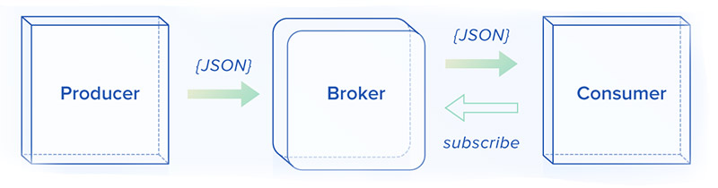

# Celery

> Asynchronous task queue/job queue based on distributed message passing




**example**: https://github.com/mattkohl/docker-flask-celery-redis


**How task scheduling works**

- Client sends new task to message broker
- message broker stores task in result backend
- worker fetches task over message broker
- saves task over message broker to result backend
- Client polls result backend for completed task

**Steps to integrate Celery**

1. Choose a Broker (e.g. Redis/Rabbit MQ)
2. Installing Cerery
3. Define tasks
4. Running the workers


## Basic Setup and Configuration


Celery config:

https://docs.celeryproject.org/en/latest/getting-started/first-steps-with-celery.html


## Starting a Celery worker

- start celery worker for `tasks` module:

`$ celery -A tasks worker --loglevel=info`


## Task Definition

#### Defining Tasks

- default broker port for Redis: `6379`

```python
from celery import Celery
MODULE_NAME = 'tasks'
BROKER_URL = 'redis://localhost:6379'
app = Celery(MODULE_NAME, broker=BROKER_URL)

@app.tasks
def add(x,y):
    return x + y
```


**Names**

```python
@app.task(name='sum-of-two-numbers')
def add(x, y):
    return x + y
```

**Importing Tasks**

- always use absolute imports
- or new-style relative imports

```python
from project.myapp.tasks import mytask
from .module import foo
```


### Logging

```python
from celery.utils.log import get_task_logger

logger = get_task_logger(__name__)

@app.task
def add(x, y):
    logger.info('Adding {0} + {1}'.format(x, y))
    return x + y
```


### Best-Practices


### Task Sets

```python

```


## Task Definition Primitives

http://docs.celeryproject.org/en/master/userguide/canvas.html#the-primitives


The concept of Signatures


**Note:** Accessing the signature of a task: `mytaskname.s`


### Chains

- links signatures sequentially (chain of callbacks)

```python
from celery import chain
res = chain(add.s(2, 2), add.s(4), add.s(8))()
```


### Groups

- list of tasks that should be applied in parallel

```python
from celery import group
res = group(add.s(i, i) for i in xrange(10))()
```


### Chord

- Group with additional callback that is executed after all tasks have finished
- synchronization is expensive; avoid chords if possible


### Map

- Creates a temporary task where a list of arguments is applied to the task

` task.map([1, 2])` results in `res = [task(1), task(2)]`


### Starmap

- Like map but arguments are applied as `*args`

`add.starmap([(2, 2), (4, 4)])`  results in `res = [add(2, 2), add(4, 4)]`


### Chunks

- splits a long list of arguments into parts

**Example:**

- split arguments `[(0, 0), (1, 1), (2, 2) ,...]` into chunks **10**

- resulting in **100** tasks, each processing **10** items in sequence


```python
>>> items = zip(xrange(1000), xrange(1000))  # 1000 items
>>> add.chunks(items, 10)
```


## Task Scheduling

**From within the task code base**

```python
@app.tasks
def add(x,y):
    return x + y

add.delay(1, y=2)
add.apply_async(args=[1], kwargs={'y': 2})
```

**From outside the task code base**

- use `Celery` instance with same broker url

```python
from celery import Celery
MODULE_NAME = 'tasks'
BROKER_URL = 'redis://localhost:6379'
app = Celery(MODULE_NAME, broker=BROKER_URL)

app.send_task('tasks.add', (2,5))
```


#### Linking Tasks and Error Callbacks

- `add.s()` is a signature

```python
add.apply_async((2, 2), link=add.s(16))
```

```
@app.tasks
def error_handler(uuid):
    result = AsyncResult(uuid)
    exc = result.get(propagte=False)
    print("Task {} raised exception".format(uuid))
    print(result.traceback)
    
add.apply_async((2, 2), link_error=error_handler.s())
```


## Fetching the Task Results


```python

```


## Task Monitoring


flower