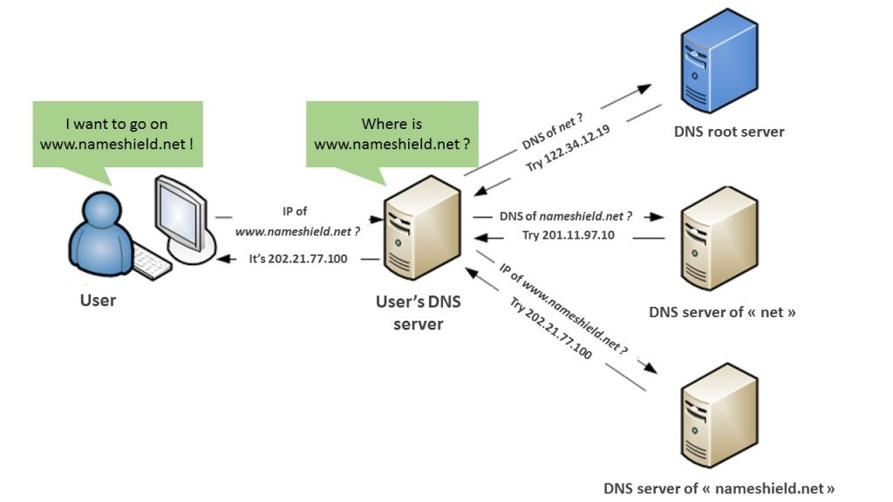

# Domain Name Systems (DNS)


### Record Types

- **NS** (name server), determine which servers will communicate DNS information for a domain
  A (address), links a domain to the physical IP address of a computer hosting
- **CNAME** (canonical name), links an alias name to another true or canonical domain name. www.example.com might link to example.com
- **MX** (mail exchange)

### `CNAME` Canonical Name

- alternative to `A` record when domain or subdomain is an alias of another domain
- all `CNAME` records must point to a domain, never to an IP adress

**Example**

- make `.net` alias of `.com`

```
www.example.net. CNAME www.example.com.
```

### `NS` Nameserver


### `SOA ` Start of Authority

Every domain must have a Start of Authority record at the cutover point where the domain is delegated from its parent domain.

**Example**

`mycompany.com` is delegated to your Name Servers: we must include an SOA record for the name mycompany.com in our authoritative DNS records. 

```
ns-2048.awsdns-64.net. hostmaster.example.com. 1 7200 900 1209600 86400
```

**Contents of a SOA entry**

- **Primary name server** that created the SOA record, for example, `ns-2048.awsdns-64.net`.                                          

- **The email address of the administrator**. The `@` symbol is replaced by a period, for example,	`hostmaster.example.com`. The default value is an amazon.com email address that is not monitored.                                          

- **A serial number** that you  can optionally increment whenever you update a record in                                             the hosted zone. Route 53  doesn't increment the number  automatically. (The serial number is used by DNS services that support secondary DNS.) In the  example, this value is `1`.                                          

- **A refresh time** in seconds that secondary DNS servers wait before querying the primary                                             DNS server's SOA record to check for changes. In the example, this value is `7200`.                                          

- **The retry interval** in seconds that a secondary server waits before retrying a failed                                             zone transfer. Normally, the retry time is less than the refresh time. In the example, this value is `900` (15 minutes).                                           

- The time in seconds that a secondary server will keep trying to complete a zone transfer.                                             If this time elapses before a successful zone transfer, the secondary server will stop answering queries                                             because it considers its data too old to be reliable. In the example, this value is `1209600` (two weeks).                                          


## What is the DNS?

> The process of DNS resolution involves converting a hostname (e.g. www.example.com) into an IP address (e.g. 192.168.1.1 in IPv4 or 2400:cb00:2048:1::c629:d7a2 in IPv6).


## DNS Resolution

> During an uncached DNS query, whenever a user enters a web address into  their browser, this action triggers a DNS lookup, and all DNS lookups  start at the root zone. Once the lookup hits the root zone, the lookup  will then travel down the hierarchy of the DNS system, first hitting the TLDs servers, then the servers for specific domains (and possibly  subdomains) until it finally hits the [authoritative nameserver](https://www.cloudflare.com/learning/dns/dns-server-types#authoritative-nameserver) for the correct domain, which contains the numerical [IP address](https://www.cloudflare.com/learning/dns/glossary/what-is-my-ip-address/) of the website being sought. 




1. A user types ‘example.com’ into a web browser and the query travels  into the Internet and is received by a DNS recursive resolver.
2. The resolver then queries a DNS root nameserver that responds to the resolver with the address of a  Top Level Domain (TLD) DNS server (such as .com or .net), which stores  the information for its domains. 
   - When searching for example.com, our  request is pointed toward the .com TLD.
3. The resolver then makes a request to the .com TLD.
4. The TLD server then responds with the IP address of the domain’s nameserver, example.com.
5. Lastly, the recursive resolver sends a query to the domain’s nameserver.
6. The IP address for example.com is then returned to the resolver from the nameserver.
7. The DNS resolver then responds to the web browser with the IP address of the domain requested initially.
8. Once the 8 steps of the DNS lookup have returned the IP address for  example.com, the browser is able to make the request for the web page:
9. The browser makes a [HTTP](https://www.cloudflare.com/learning/ddos/glossary/hypertext-transfer-protocol-http/) request to the IP address.
10. The server at that IP returns the webpage to be rendered in the browser (step 10).


### DNS Caching

> The purpose of caching is to temporarily stored data in a location that  results in improvements in performance and reliability for data  requests.


**Browser DNS caching**

- modern browser cache DNS records by default for a set amount of time
- browser cache is always checked first

Inspecting the DNS cache in Chrome: [chrome://net-internals/#dns](chrome://net-internals/#dns)


**OS system level DNS caching**

- last local stop before DNS query leaves machine
  - process is called "stub resolver" or DNS client
- additional functionality:
  - cache NS records of authoritative nameservers - bypass e.g. lookups from root and top-level-domain nameservers

*Example*: display DNS cache on Windows `ipconfig /displaydns`


### The DNS Root Server

-  There are **13 different IP addresses** that serve the DNS root zone (limitation of the DNS design)
- Every DNS resolver has a list of the 13 IP root server addresses built  into its software. Whenever a DNS lookup is initiated, the recursor’s  first communication is with one of those 13 IP addresses.
- hundreds of redundant root servers exist around the globe to handle  requests to the root zone.
- Ultimate authority over the root zone belongs to the National  Telecommunications and Information Administration (NTIA), which is a  part of the US Department of Commerce.
  - 1 ip address is operated by ICANN, other 12 are delegated to various organizations (e.g. NASA)


## Resolving DNS Issues


**Inspect DNS Issues**

- `curl -X POST "https://example.com" -v`

- `dig +notrace example.com` (alternative: nslookup)
