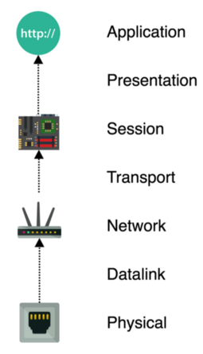

# OSI Model

> The **Open Systems Interconnection model** (**OSI model**) is a [conceptual model](https://en.wikipedia.org/wiki/Conceptual_model) that characterises and standardises the communication functions of a [telecommunication](https://en.wikipedia.org/wiki/Telecommunication) or computing system without regard to its underlying internal structure and technology.

1. At the application layer a web browser constructs an HTTP request, which  is a small text document describing what resource the browser wants to  fetch from a web server.
2. In order to make sure the communication between browser and server is  secure the web request is encrypted using SSL/TLS. This process takes a  server’s public key and uses it to turn the HTTP payload into an  unreadable chunk of encrypted binary data.
3. A few layers below at the transport layer the encrypted payload is split  up into TCP packets. Each packet is a piece of the HTTP payload wrapped  in metadata such as the source IP address that the packet originated  from and the destination IP address where the packet should go.
4. The physical layer takes the raw digital 1’s and 0’s that make up TCP  packets and turns them into an analog signal such as an electrical pulse on a copper wire, a light pulse in a fiber optic cable, or a radio wave in the air. On the other end another device turns that analog signal  back into a digital 1’s and 0's.
5. The network traffic starts its trip back up the network stack as the 1’s  and 0’s are interpreted into packets, which are then reassembled into  the original encrypted data payload.
6. The server uses its private key to decrypt the SSL/TLS encrypted payload back into the original plaintext HTTP request document.
7. The server is able to interpret the plaintext HTTP request and figure out what resource to deliver back over the network.