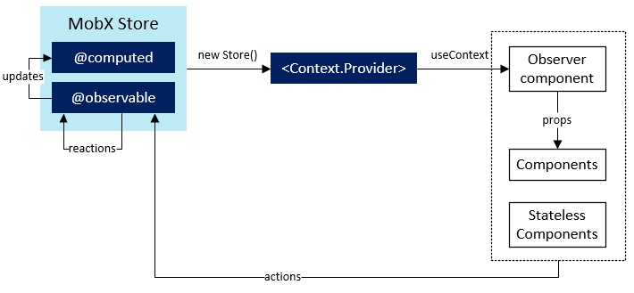

# State Management with MobX


**Main Components**

- **observable**: A state that is observable
- **computed**: A derived observable state
- **action**: A method that alters state
- **observer**: a context that listens to state change





## Core Concepts

**Observable**

- when the data changes, the observable object notifies the observers
- `@observable`

```js
class TodoStore {
  @observable todos: Todo[]
}
```

**Actions**

- way to change observable (update the state)
- `@action`

```js
@action toggleTodo = (todo: string) => {
    this.todos.push_back(todo);
};
```

**Computed**

- derive values from existing state / other computed values
- `@computed`

```js
@computed get isEmpty() {
    this.todos.len == 0;
}
```

**Reactions**

- track observables from inside the store itself
- trigger side effects

```js
class TodoStore {
  constructor() {
    reaction(
      () => this.todos,
      _ => console.log(this.todos.length)
    );
}
```


## Observable State

> Data that drives application


**Making State Observable**

- `@observable` annotation 
  - on individual properties
- `makeObservable` (**recommended**)
  - specify type of all methods in constructor
- `makeAutoObservable`
  - derive type of all methods during construction automatically
- direct use of MobX observable datastructures
  - `observable.array`, `observable.map`, ...
  - `@observable` and `makeObservable` create a copy and then mount the data in containers


### Make State Observable

> There are multiple options to make state observable, see below.


#### A. `makeObservable`

> Recommended way.

- make **existing** object properties observable
- typically used in constructor of class

**Usage**

`makeObservable(target, annotations?, options?)`

- `annotations` argument maps annotations to each member
- (Deprecated in MobX V6): `annotations` can be omitted if decorators are used (e.g. `@observable`, `@action`, ...)

**Example:**

```javascript
import { makeObservable, observable, computed, action } from "mobx"

class Doubler {
    value
    constructor(value) {
        makeObservable(this, {
            value: observable,
            double: computed,
            increment: action
        })
        this.value = value
    }
    get double() { return this.value * 2}
    increment() { this.value++ }
}
```


#### B. `@observable` Annotation

- `observable(source, overrides?, options?)`

**Example:** Decorator

```javascript
import { observable } from "mobx"
class Todo {
    id = Math.random()
    @observable title = ""
    @observable finished = false
}
```

**Example:** Method/function

```javascript
const peopleStore = observable([
  { name: "Michel" },
  { name: "Me" }
]);
```


#### C. `makeAutoObservable`

- like `makeObservable` but infers all properties
- `false` can be used to exclude property/method
- cannot be used with super/sub-classes

**Example**

```javascript
class Animal {
    name
    energyLevel

    constructor(name) {
        this.name = name
        this.energyLevel = 100
        makeAutoObservable(
            this, {
                name: false // exclude property name
            }
        )
    }
    reduceEnergy() {this.energyLevel -= 10}
    get isHungry() {return this.energyLevel < 50}
}
```

### State References

> References between stores are automatically handled

**Example**

```javascript
const peopleStore = observable([
  { name: "Michel" },
  { name: "Me" }
]);
observableTodoStore.todos[0].assignee = peopleStore[0];
observableTodoStore.todos[1].assignee = peopleStore[1];

// also updates observableTodoStore
peopleStore[0].name = "Michel Weststrate";
```


## Actions

> **Actions** update the state. Actions run inside *transactions* - no observers are updated until outer-most action has finished.
>
> Same with **observables**, there are multiple ways of defining actions.

- MobX requires declaration of actions
- `makeAutoObservable` can automate annotation
- only methods that **modify** the state should be marked as actions, **not** methods that perform filtering/calculations on the state
- action should be passed as far outwards as possible (method that calls an *action* is also an `action`)


#### Option A: `makeObservable` 

> Recommended way. Can also be used for **observables**.

```tsx
class Counter {
    value: int = 0
    constructor() {
        makeObservable(this, {
            increment: action
        })
    }
    increment() { this.value++ }
}
```

#### Option B: @action annotation

- `@action`

```js
@action changeProperty(store) {
    store.some_property = 123;
}
```


#### Option C: `action()` method wrapper

> Useful for inline action methods

- `action` is annotation **and** function

```jsx
const increment = action(state => {
    state.value++
})
```


#### Examples

**Example**: click handler

```jsx
import { action } from "mobx"
const ResetButton = ({ formState }) => (
    <button
        onClick={action(e => {
            formState.resetValues()
            e.stopPropagation()
        })}
    >
        Reset form
    </button>
)
```

**Example: **Async Action

```javascript
setTimeout(action(() => {
  observableTodoStore.addTodo('Random Todo ' + Math.random());
}), 2000);
```


### Asynchronous Actions

- no special treatment - updates work automatically
- handlers that update state should be `actions`

**Example:** Wrap handlers in `action`


```javascript
import { action, makeAutoObservable } from "mobx"

class Store {
    githubProjects = []
    state = "pending" // "pending", "done" or "error"

    constructor() {
        makeAutoObservable(this)
    }

    fetchProjects() {
        this.githubProjects = []
        this.state = "pending"
        fetchGithubProjectsSomehow().then(
            action("fetchSuccess", projects => {
                const filteredProjects = somePreprocessing(projects)
                this.githubProjects = filteredProjects
                this.state = "done"
            }),
            action("fetchError", error => {
                this.state = "error"
            })
        )
    }
}
```


## Derivatives / Computed Properties

> Computed values can be used to derive information from other observables.

- **purpose**: evaluated lazily, have output caching

- declaration:
  - use `makeObservable` to declare getter as computed
  - (Deprecated) decorators
- method **must** be marked as `get` and have no arguments

**Example:** Decorator

```javascript
import { observable, computed } from "mobx"

class OrderLine {
    @observable price = 0
    @observable amount = 
    constructor(price) {
        this.price = price
    }
    @computed get total() {
        return this.price * this.amount
    }
}
```

### Computed with Arguments

- derivations don't need to be `computed` in order for MobX to track it
- computed values are only *caching points*
- `observer` component will subscribe to detect and subscribe to any observables that are 

**Example:**

```js
import * as React from 'react'
import { observer } from 'mobx-react-lite'

const Item = observer(({ item, store }) => (
    <div className={store.isSelected(item.id) ? "selected" : ""}>
        {item.title}
    </div>
)
```


## MobX and React

- always read observables inside `observer` components
- `observer` automatically tracks observables used during render
- `observer` works best if you pass object references around as long as possible, and only read their properties inside the `observer` based components that are going to render them into the DOM / low-level components. In other words, `observer` reacts to the fact that you 'dereference' a value from an object.
- **whole components** must be wrapped in `observer`, not only rendering methods

**When to make property observable?**

The rule of thumb is: *apply `observer` to all components that read observable data*.


**observer() vs useObserver() vs <Observer>** 

- `observer()`: Wraps a component in 'autorun' to render it whenever an observable change
- `<Observer>`: instantiates a fresh component that iself is an observer, so it tracks the function you pass and re-render whenever observables used in it change
- `useObserver`: tracks only the specific function (rather than the entire component body like observer) and re-renders whole component if some observables used by that function changes


#### A. `observer()` on Props

```jsx
import { observer } from "mobx-react-lite"
// the store
const myTimer = new Timer()
// view that binds to the store through "observer()"
const TimerView = observer(({ timer }) => <span>Seconds: {timer.secondsPassed}</span>)
// pass store to the view
ReactDOM.render(<TimerView timer={myTimer} />, document.body)
```

#### B. `@observer` HOC for class based React components

- wraps entire component

```jsx
import { observer } from "mobx-react"

@observer
class Timer extends extends React.Component<{myMobxState: AppState}, {}> {
    render() {
        return <span>Seconds passed: {this.props.myMobxState.someProperty} </span>
    }
}
```

#### C. `useObserver()` in functional component

```jsx
const TodoList = () => {
    const store = useStore()
    return useObserver(() => (
        <div>store.a_property</div>
    ))
}
```

```js
const Parent = observer(() => {
  return <Child value={store.value} />;  
})
```


## Common Pitfalls


### Observable Arrays

- In ES5 there is no way to reliably inherit from arrays, and hence **observable arrays inherit from objects**.


**Example:** Observing arrays

Store definition

```tsx
import { observable } from 'mobx'
export class Store {
    things: number[]
    constructor() {
        // annotate the array as observable
        makeObservable(this, {
            things: observable
        })
    }
}
```

Store observer

```js
export const MyComponent = withStore(({ store }) => {
    // Make a local copy of the array so that we can track it.
    // Passing store.my_array.slice() directly through the props
    // DOES NOT work.
    const state_copy = store.my_array.slice()
    return useObserver(() => (<ThirdPartyComponent prop={state_copy}))
})
```


### Transforming observables

**Transforming properties**

```jsx
const transform = (input: number): string => {
    return `Original: ${input}, +2: ${input + 2}`
}
export const Summary = withStore(({ store }) => {
    return useObserver(() => (
        <div>Vehicle count: {transform(store.vehicles.length)}</div>
    ))
})
```


- Arrays can not easily be inherited from, hence 


## Open Questions


- How to you slice/track an object array **before** passing it on to another component?
  - we **don't** want to pass the properties individually and we **don't** just want to pass the array
