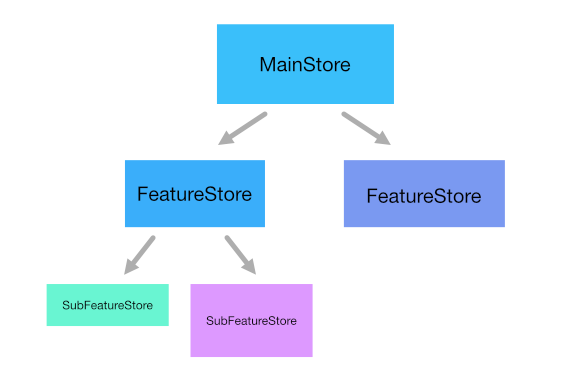

# Store Design

- Class instances will never be made observable automatically by passing them to `observable`


## What is observed?

**Observing Class Instances**

- Classes are **not** automatically observed like plain objects
- use `makeObservable` in class constructor
- add `"useDefineForClassFields": true` to Typescript configuration

**Converting observables back to vanilla JS**

```js
const plainObject = { ...observableObject }
const plainArray = observableArray.slice()
const plainMap = new Map(observableMap)
```


## Organizing Stores / State




### Linking Stores

```ts
class Parent {
  Parent(){
    child = Child(parent: this);
  }
  Child child;
}
```


## Initializing Models / Stores


```tsx
class Person {
    public name: string = "default"
    public address?: string = "default"
    public constructor(init:Person) {
        Object.assign(this, init);
    }
}

let persons = [
    new Person(), 
    new Person({}), // error
    new Person({name:"John"}),
];
```


## Examples


### Global Store


TODO

```js
const MyContext = React.createContext(defaultValue);
```

```js
<MyContext.Provider value={/* some value */}>
```


**Example:** Global Store

1. Define the store context

```jsx
import React, { createContext } from 'react';
import { StoreModel } from '../stores';
export const StoreContext = createContext<StoreModel>({} as StoreModel);
```

2. Define the store provider

```jsx
import { FC, createContext, ReactNode, ReactElement } from 'react';
export const StoreProvider: StoreComponent = ({
  children,
  store
}): ReactElement => {
  return (
    <StoreContext.Provider value={store}>{children}</StoreContext.Provider>
  )
}

/* Hook to use store in any functional component */
export const useStore = () => React.useContext(StoreContext)

/* HOC to inject store to any functional or class component */
export const withStore = (Component) => (props) => {
    return <Component {...props} store={useStore()} />
}
```

3. Wrap the application in the store provider

```jsx
<StoreProvider store={new StoreModel()}>
    <App />
</StoreProvider>
```


4. Access the store


