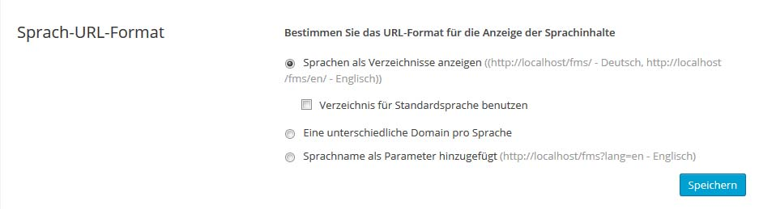

# WPML Translation

## Setup

1. **Plugin setup:**
2. 

2. **URL Format**
3. 

3. **String Translation**
4. 

## ACF - Advanced Custom Fields

### General Settings

**Same fields for all languages:**
Regular case

**Different fields for individual languages:**
Example: Change Fieldname for different languages

### Field Specific Settings

**Force same custom field value across languages:**

`fieldname`: copy
`_fieldname`: translate (refers to field key, which is individual for languages)

### Avoid data loss

- **Copy**: (upon update of the post) copy across the original post’s value and replace the translated post’s value. Please note that this setting deos not change to ‘Translate’ after the post has been saved, so if you have selected ‘Copy’, ACF will not be able to save a unique value for the translated post.

- **Translate**: will do nothing, and allow ACF to correctly save the custom field data to the post.

You will notice that WPML shows hidden custom field values such as ‘_image’. These should not be copied as the value relates to a field and because each field is different for each translation, these should also be. In short, ignore the underscore fields and leave as ‘Translate’

