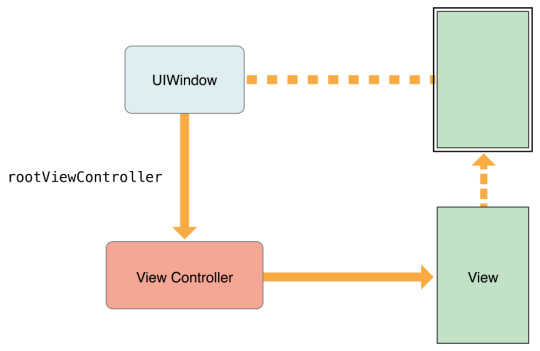
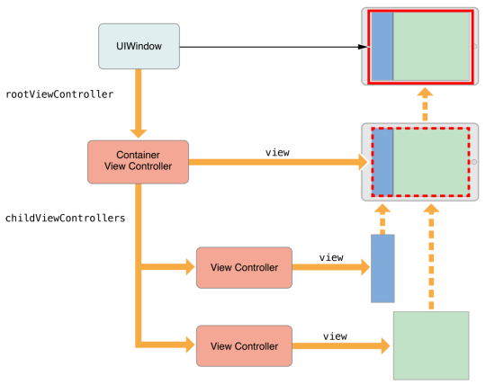
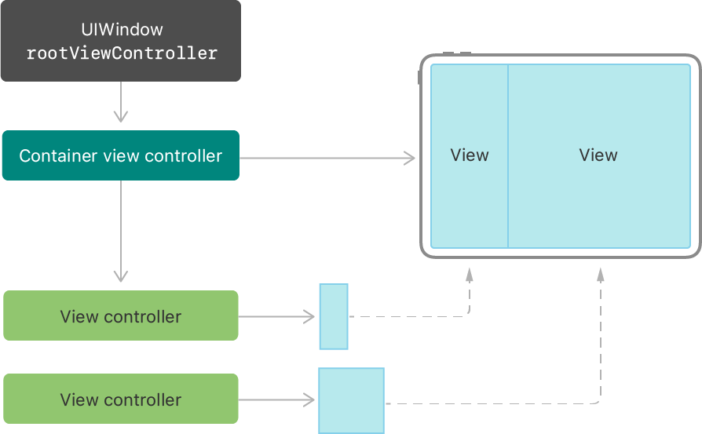

# View Controllers and UI

> Manages user interface and interaction between interface and data


**View Controllers and Views**

- **Controller:**
- **Views:**


## The Hierarchy

### The Root View Controller

> The **Root View Controller** is the anchor of the view controller hierarchy. Every Window has 1 root view controller which defines the initial content seen by the user.



### Container View Controllers

> Container view controllers let you assemble sophisticated interfaces and manage them in re-usable pieces.




## Controller View States

> Each view controller can implement callbacks that are fired when the visibility of the view controller changes.

- use visibility change challbacks to instantiate your controller logic (e.g. bind views or (un-)register gestures)


## Creating View Controllers


**View Controller base classes**

- `UIViewController` for everything
- `UICollectionViewController`
  - if main view is a collection of views
- `UITableViewController`
  - if main view is a table view


## A. Programmatic UI Design


### Creating a view controller

- Inherit from `UIViewController`
- Implement

`ViewController.h`

```objective-c
#import <UIKit/UIKit.h>
@interface ViewController : UIViewController
@end
```

`ViewController.m`

```objective-c
#import "ViewController.h"
@implementation ViewController
- (void)viewDidLoad {
    [super viewDidLoad];
    // add all other initialization logic, e.g.
    // 1. Setup UI (views)
    // 2. Bind Gestures
}
@end
```


### Adding a child view controller





1. call `addChild(_:)` method on container view controller to configure the relationship
2. Add child's root view to the container's view hierarchy
3. Add constraints to set the size and position of the child's root view
4. 

**TODO:** Code sample


### Creating a custom `XIB` View 

1. Create a new file of type "View" (looks like a single empty storyboard file)
2. Choose size on the top right in the "Attribute Inspector"


### Creating a programmatic View


### Creating a View through the Storyboard


### Adding a View to a controller


## B. Visual UI Design

There are two ways of defining UI visually:

- **Storyboard**: holds a set of view controllers and views which are connected to code and define a whole state machine
  - is a collection of XIBs and navigation bar
- **XML Interface Builder** (XIB): Visual way to define a UI view and link to it from code
- **NIB** files, see https://developer.apple.com/library/archive/documentation/General/Conceptual/DevPedia-CocoaCore/NibFile.html#//apple_ref/doc/uid/TP40008195-CH34


## Defining the UI using the Storyboard

**Example View Controller**

```cpp
@interface ViewController : UIViewController
@end
```

#### View Controller Types

**Regular View Controller**

**Container View Controller**

- Example: Tab Bar
- Contains multiple sub-views

**Navigation View Controller**

- Bar Button Item


## NavigationViewController


## Views

- Views created in the storyboard are automatically initiated (no need to init them in view controller code)
- Custom view classes can be selected to implement the UI callbacks
- All outlets that connect storyboard elements to code are marked with `IBOutlet`

**Creating callbacks for storyboard views**

0. Create a custom view class in code

``` cpp
@interface InterfaceView : UIView
@end
```

1. Click on view
   
2. Select view class that implements the callbacks from attributes tab
   
3. Connect your outlets to the UIView subclass in the code (right-click drag and drop)

**Reconnecting Code Callbacks to Storyboard**

- Code Outlets are marked with dots. Connected ones are filled.
- Available outlets are also visible in the view property tab of the storyboard
- Right-click drag & drop from code dot to storyboard element
  

**Debugging UIView order**


**Connecting Storyboard View delegates**

- Create custom view class and delegate property

```cpp
@property (nonatomic, weak) IBOutlet id <InterfaceViewDelegate> delegate;
```

- drag&drop property onto view controller in storyboard
- The delegate will appear in the property tab of the view controller (in the storyboard)
  

