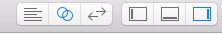
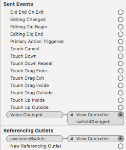

# iOS Application Development

**Tutorials**
- [CodePath iOS Guides](https://guides.codepath.com/ios) - very good!


**Examples**
- [Objective-C: Single View Application](./tutorial_objective-c.md)


## Terminology

**Scene**
- represents one screen of content and (typically) one view controller

**View Controller**
- Implements app's behaviour
- Manages single content view with its hierarchy of subviews
- All view controllers are of type `UIViewController` or one of its subclasses

**Storyboard**
- Visual compositor for the UI
- Connection between the defined code (view controller) and the UI is defined here

**Outlets**
- reference interface objects from the storyboard in source code files
- Storyboard UI Element <-> code link

## Project Structure

```bash
- YourApplication
    AppDelegate.h / .m / .swift         // app launch points
    ViewController.h / .m / .swift      // view controller
	Main.storyboard                     // view
```

**Default iPhone App Flow**
`AppDelegate (Object) > View Controller (Object) > View Controller (View)`


- `AppDelegate` Creates a ViewController object when app is launched
- `ViewController` Sets up the view described in `Main.storyboard` and shows it on the screen


## The Storyboard
- The storyboard (default: `Main.storyboard`) shows all the contents of the scenes
	- set in `info.plist` "Main storyboard file base name"
	- or in settings: "Project Settings > General > Deployment Info"

**Switching the Storyboard View**
- e.g. Display code and UI layout side by side



**Default Scene Contains:**
- View Controller
- First Responder
- Exit
- Storyboard Entry Point (first view)


**Scene Dock**
- Miniature version of the document outline


## Navigation in iOS

Mechanisms:
- Push navigation
- Modal navigation
- Tab Navigation


### Push


### Modal

### Tab


# UI Elements

## Switch

- Add switch to Storyboard
- **Link switch state**: Right-Click drag&drop into `@interface` section of `ViewController.m` (current scene view controller)
- **Link action**: Right-Click drag&drop into `@implementation` section
	- From the context menu, select the preferred action ()

```cpp
@interface ViewController () <ARSCNViewDelegate>
// state
@property (weak, nonatomic) IBOutlet UISwitch *awesomeSwitch;
@end

// action
@implementation ViewController
- (IBAction)switchPressed:(id)sender {
}
@end
```

**Verify view controller outles:**
- Go to Storyboard, select switch




## Button

**Add button programatically**
```cpp
UIButton *button = [UIButton buttonWithType:UIButtonTypeCustom];
[button addTarget:self
           action:@selector(aMethod:)
 forControlEvents:UIControlEventTouchUpInside];
[button setTitle:@"Show View" forState:UIControlStateNormal];
button.frame = CGRectMake(80.0, 210.0, 160.0, 40.0);
[view addSubview:button];
// bring button to front
[view bringSubviewToFront:button];
```


## ARKit SceneKit View

- In the Storboard, add "ARKit SceneKit View" to a view
- **Link AR View**: Drag&drop view onto `@interface` section
- **Configure tracking**: In standard view controller method `(void)viewDidLoad`
- **Start tracking**: In standard view controller method `(void)viewWillAppear`
- **Pause tracking**: In standard view controller method `(void)viewWillDisappear`


```cpp
@interface ViewController () <ARSCNViewDelegate>
// the AR view
@property (strong, nonatomic) IBOutlet ARSCNView *sceneView;
@end
```


**View loaded: Configure tracking**

```cpp
- (void)viewDidLoad {
    [super viewDidLoad];
    // Set the view's delegate
    self.sceneView.delegate = self;
    // Show statistics such as fps and timing information
    self.sceneView.showsStatistics = YES;
    // Create a new scene
    SCNScene *scene = [SCNScene sceneNamed:@"art.scnassets/ship.scn"];
    // debug options
    self.sceneView.debugOptions =
    ARSCNDebugOptionShowWorldOrigin |
    ARSCNDebugOptionShowFeaturePoints;
    // Set the scene to the view
    self.sceneView.scene = scene;
}
```

**View appear: Run tracking session**
```cpp
- (void)viewWillAppear:(BOOL)animated {
    [super viewWillAppear:animated];
    // Create a session configuration
    ARWorldTrackingConfiguration *configuration = [ARWorldTrackingConfiguration new];
    // Run the view's session
    [self.sceneView.session runWithConfiguration:configuration];
}
```

**View disappear: Pause tracking session**
```cpp
- (void)viewWillDisappear:(BOOL)animated {
    [super viewWillDisappear:animated];
    // Pause the view's session
    [self.sceneView.session pause];
}
```

## Element Constraints
**Add new constrainsts**
- Instead of fixed location on screen


**Adding Missing Constraints automatically**


# Deployment

**Deployment iOS Version**
- Go to project settings > Build Settings > Deployment
- Set iOS Deployment Target to the device iOS version


# UIView

```cpp
@interface ViewController () <TrackingControllerDelegate>
@property (strong, nonatomic) UIImageView *imageView;
@end
```

**initialization & frame size**
```cpp
_imageView = [[UIImageView alloc] init];
// define frame
_imageView.frame = _sceneView.frame;
```

**Container Scaling**
```cpp
_imageView.contentMode = UIViewContentModeScaleToFill;
_imageView.autoresizingMask = UIViewAutoresizingFlexibleWidth | UIViewAutoresizingFlexibleHeight;
```


**Image Orientation**


### Handling Device Rotation

- [Tutorial](https://happyteamlabs.com/blog/ios-using-uideviceorientation-to-determine-orientation/)


# ARKit Application

#### Initialization

```cpp
@interface <your view controller name>()
@property (nonatomic, strong) ARSession *session;
@end


// then somewhere in your implementation block...
// official example shows you ought to declare the session in viewWillLoad and initialize in viewWillAppear but it probably doesn't matter.
self.session = [ARSession new];

// World tracking is used for 6DOF, there are other tracking configurations as well, see
// https://developer.apple.com/documentation/arkit/arconfiguration
ARWorldTrackingConfiguration *configuration = [ARWorldTrackingConfiguration new];

// setup horizontal plane detection - note that this is optional 
configuration.planeDetection = ARPlaneDetectionHorizontal;

// start the session
[self.session runWithConfiguration:configuration];
```


# Gesture Recognition


**Propagating Clicks through transparent Views**

- Create a custom subclass  of `UIView` and assign it to the transparent click-through view
- implement the method `pointInside` which passes the clicks to underlying views if it does not hit a subview (e.g. button)
```cpp
-(BOOL)pointInside:(CGPoint)point withEvent:(UIEvent *)event {
    for (UIView *view in self.subviews) {
        if (!view.hidden && view.userInteractionEnabled && [view pointInside:[self convertPoint:point toView:view] withEvent:event])
            return YES;
    }
    return NO;
}
```


