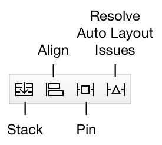
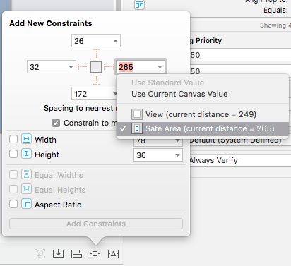
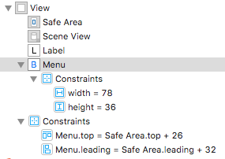
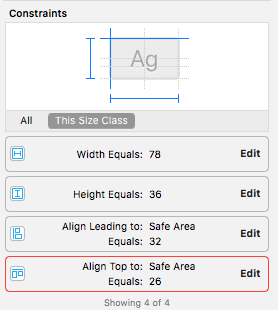

# Storyboard Layouting

**Misc**
- define size: ctrl-drag onto self

## Tools

#### Pin Tool

- Define position relative to neighbours and width/height
- **Top part**: define spacing to neighbours
- **Bottom part**: define width/height

#### Align Tool

## Editing Constraints

