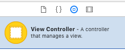
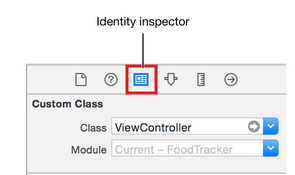
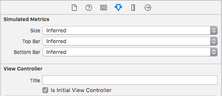

# Single View Application in Objective C


## 1. Create a new project from an XCode Template

Project structure:

- YourApp
    - `AppDelegate.h/.m	` default application launch point, no content
    - `Main.storyboard`	 the main view/scene overview
    - `LaunchScreen.storyboard` view/scene for the launch screen
    - `info.plist`  project settings (requirements, storyboard selection, app identifier)
    - `main.m` launches the application with `AppDelegate`

## 2. Specify Storyboards

- open `info.plist` and select the storyboard files in "Main storyboard file..." and "Launch screen interface file..."
- Select the project, go the "General" tab and select the main storyboard file in the section "Deployment Info" under "Main interface"

## 3. Add View Controller to Storyboard

- Open `Main.storyboard`
- Select *Object Library* and drag&drop **"View Controller"** into scene



## 4. Add View Controller Source

**ViewController.h**
```cpp
#import <UIKit/UIKit.h>
@interface ViewController : UIViewController
@end
```

**ViewController.m**
```cpp
#import "ViewController.h"

@implementation ViewController
- (void)viewDidLoad {
  [super viewDidLoad];
}
@end
```


**Connecting View Controller to Storyboard**

- Switch to Storyboard and select the *View Controller* in the scene content
- Select identity inspector and select the controller class `ViewController` that was created in the code


**Select Initial View Controller**
- Select view controller in storyboard and check **Is Initial View Controller**
- **Or**: Drag & Drop app entry point arrow in storyboard onto the specified view controller


## 5.1 Adding Storyboard View
- Drag&Drop View element from objects library onto view controller in storyboard

**Adding code callbacks**

- Create new `UIView` child class

```cpp
@interface MyView : UIView
@end
@implementation MyView
@end
```
- Switch to storyboard, select the view and switch to "Identity Inspector" Tab
- Select the new class `MyView` as the *Custom Class*

## 5.2 Adding Programmatic View

- Create new `UIView` child class
- Create view instance in view controller

```cpp
@interface ViewController
    @property (strong, nonatomic) MyView *myView;
@end
@implementation ViewController
- (void)viewWillAppear:(BOOL)animated {
	self.myView = [[MyView alloc] init];
}
@end
```

## 6. Adding UI Elements

**Adding Elements from Storyboard**
- Drag&Drop elements from object library into a view
- Switch to implementation of the target view
- Drag&Drop UI elements from storyboard into code
	- Connections will appear as "dots" in the code
	- Also visible in properties tab of UI element in storyboard

**Connecting Storyboard UI Elements**
- Right-click drag&drop UI element from Storyboard into `@interface` section of `ViewController.m`
- Ensure that the outlets are configure correctly:
	- Select UI element in storyboard and select the connection inspector


**Programmatic UI Elements**
- All UI elements can also be added through code

