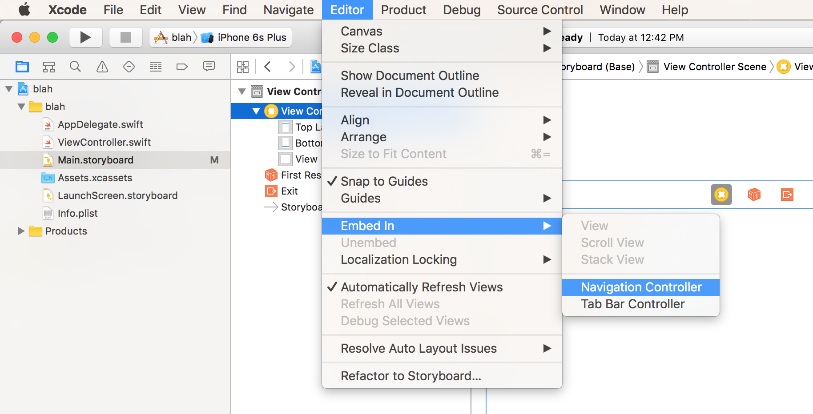

# Multi-View Application in Swift

**View Controller Hierarchy**

- Navigation View Controller
	- Main View Controller
		- View Controller 1
		- View Controller 2

## 1. Navigation Controller

- Create regular view controller, select it in storyboard
- Select "Editor > Embed In > Navigation Controller"

## 2. Connecting View Controllers

- Search for “Button” and then drag into the first view. You can change the text.
- Click to select the button that was just added.
- Hold down the “ctrl” key and drag a “connection” line to the next view.
- You will see a pop-up with “Action” options - select “show”

# Additions

**Hide Navigation Bar in Single View Controller**

**Hide Navigation Bar**
1. Go to storyboard
2. Select navigation controller
3. Goto Attribute inspector
4. Under navigation controller bar visibility **Uncheck the Shows navigation Bar**