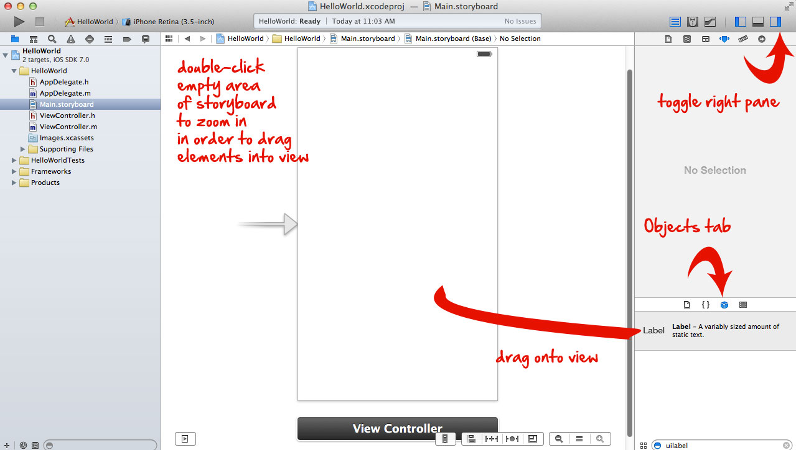
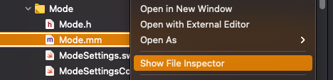
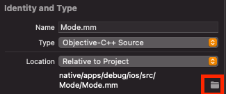

# XCode


## Experience Improvements & Hotkeys

**Hotkeys**
- [ctrl] + R: run
- [ctrl] + B: build
- [ctrl] + U: run unittests
- [alt] + LMB on file: Open in opposite editor pane

**Adjustments**
- Open files in focussed view: "Preferences > Navigation", select `Uses focused editor` in "navigation" section

**Views**
- Console: "View > Debug Area > Active Console"


## Storyboards
- The storyboard is the `view` of the application




## General Project Folder Structure


```
MyViewController.h
MyViewController.mm
- Views
  Circle.h
  Circle.m
  Square.h
  Square.m
// the assets
+ Resources
```


## Managing Project Files


### Grouping Project Files


### Organizing in real folders

1. Create the desired folder structure and move the files
2. RMB on the moved files in project tree > "Show File Inspector" (the files should have become red after moving)



2. In "Identity and Type" tab (appearing on the right panel), select the folder icon under "Location"



3. Select the file to move and the target location where the files were moved. XCode should automatically rediscover them


## 3rd Party Frameworks

- Directory that encapsules shared libraries, header files, documentations etc in a single package

#### Example: Linking an OpenCV `framework`
- Download and unpack `opencv2.framework`
- Drag and drop it into the XCode project
- No header includes or linking necessary

-------------

### Header Search Paths

- Click on ProjectInspector (Blue Icon)
- "Build Settings"

### Example: Linking OpenCV 3 from Homebrew

- Click on ProjectInspector (Blue Icon)
- "Build Settings" + "All" & "Combined"
- Head to section "Search Paths"

- **Header Search Paths** should point to the location of your OpenCV implementation, this is typically usr/local/include or if you used HomeBrew then `/usr/local/Cellar/opencv3/3.2.0/include`
- **Library Search Paths** should point to the location of your OpenCV implementation, this is typically usr/local/lib or if you used HomeBrew then `/usr/local/Cellar/opencv3/3.2.0/lib`


## Misc


### Code Signing

follow [this](https://ioscodesigning.com/generating-code-signing-files/) tutorial

### Running App on the Phone

- Connect Phone
- Unlock and `trust`
- Select Phone as build target in XCode

### Troubleshooting

**“iPhone is busy: Preparing debugger support for iPhone”**

- [See Stackoverflow](https://stackoverflow.com/questions/46316373/xcode-9-iphone-is-busy-preparing-debugger-support-for-iphone)


