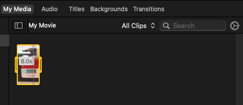

# iMovie

### Vertical video

- record screen with Quicktime

### Freeze frame

- select clip
- choose "Modify > add Freeze Frame"

### Multiple Picture-in-Picture

- **You** cannot add **more than one picture in picture** to a specific timeframe in **iMovie**

### Crop Video

1. Select video sequence from media

2. Click on the crop icon, then select the "Crop" button on the left, select the region, and press the blue "apply" button

3. Drag & drop cropped clip to timeline

### Two Videos Side-by-Side

1. Add two videos to media library
2. Drag & drop first video into timeline
3. Drag & drop second video **above** other video in timeline
4. Select **second** (top) video and choose "split screen" from the top right dropdown

### Stretch Clips to same Lengths

